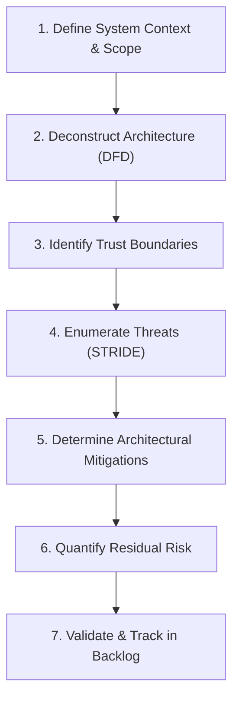

# The 7-Step Repeatable Threat Modeling Workflow

## Executive Summary

This structured 7-step process ensures consistent, high-velocity threat modeling across all enterprise engineering squads.

---

1. **Define Scope**: Identify the business problem, regulatory requirements (PCI, HIPAA), and tier criticality (Tier 1 vs Tier 3).
2. **Deconstruct Architecture**: Draw Data Flow Diagrams (Level 0 Context, Level 1 Container).
3. **Identify Trust Boundaries**: Mark boundaries where data crosses between different security control zones (Internet -> Public Subnet -> Private Subnet).
4. **Enumerate Threats**: Apply STRIDE systematically to every process, datastore, and data flow.
5. **Architectural Mitigations**: Define structural controls, algorithms, and infrastructure guardrails.
6. **Quantify Residual Risk**: Calculate post-mitigation risk using DREAD or CVSS.
7. **Track in Backlog**: Convert required security mitigations directly into Jira stories blocking production release.
