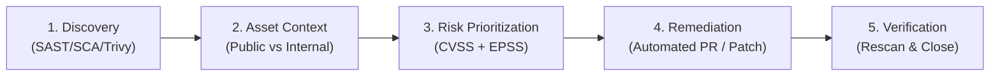

# Enterprise Vulnerability Management Framework

## Executive Summary

A mature vulnerability management framework avoids the trap of attempting to patch every low-severity CVE immediately. It adopts **Risk-Based Prioritization**, focusing engineering resources on vulnerabilities that are actively exploited in the wild.

---

## 1. 5-Stage Vulnerability Lifecycle

