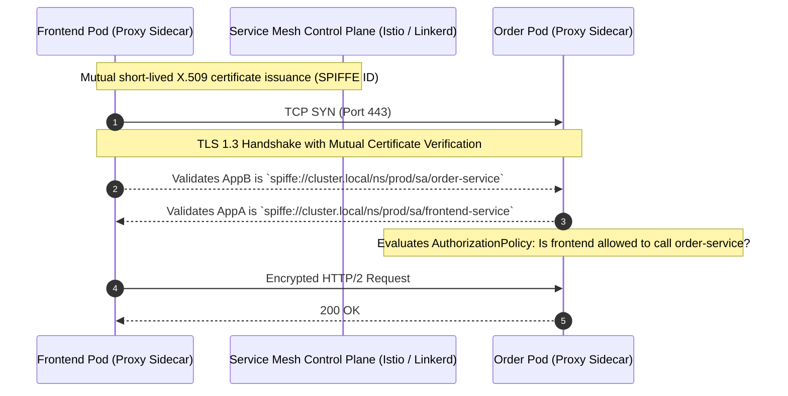

# Microsegmentation & Service Mesh Security

## Executive Summary

Microsegmentation isolates workloads from one another, preventing an attacker who compromises one low-priority container from pivoting laterally to core databases or payment services.

---

## 1. Service Mesh Mutual TLS (mTLS)

