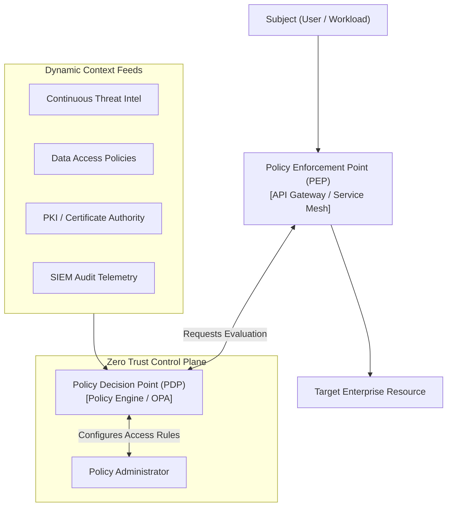

# Zero Trust Architecture Principles (NIST SP 800-207)

## Executive Summary

The NIST SP 800-207 standard establishes the canonical logical architecture for Zero Trust. Access decisions are evaluated dynamically by a **Policy Decision Point (PDP)** and enforced by a **Policy Enforcement Point (PEP)**.

---

## 1. NIST SP 800-207 Logical Architecture

