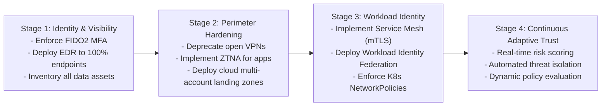

# Enterprise Zero Trust Migration Roadmap

## Executive Summary

Migrating a Fortune 500 enterprise from a legacy castle-and-moat architecture to Zero Trust is a multi-year evolutionary journey.

---

## 4-Stage Enterprise Migration Roadmap

