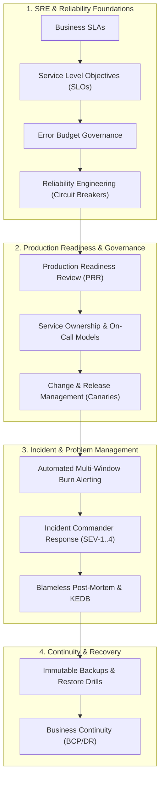

# Observability, SRE & Operations Architecture (`11-observability/`)

## Executive Summary

The `11-observability/` domain establishes the operational architecture and Site Reliability Engineering (SRE) disciplines required to operate mission-critical, high-scale distributed systems across Fortune 500 enterprises.

A system is not production-ready merely because its code compiles, unit tests pass, and cloud infrastructure is provisioned. **Production readiness is an active architectural discipline** encompassing continuous observability, deterministic reliability targets (SLOs/Error Budgets), automated incident response, blameless problem management, and tested disaster recoverability.

---

## Domain Directory Index

| Directory | Scope | Core Focus |
| :--- | :--- | :--- |
| [`operations-principles.md`](operations-principles.md) | Principles | 15 Non-negotiable operational & SRE architectural principles |
| [`operational-maturity-model.md`](operational-maturity-model.md) | Maturity Model | Level 1 (Reactive) through Level 5 (Engineering-Driven) |
| [`sre/`](sre/) | SRE Foundations | Toil budgets, SLA vs SLO vs SLI, error budget burn rates |
| [`reliability-engineering/`](reliability-engineering/) | Resilience Patterns | Circuit breakers, bulkheads, load shedding, chaos engineering |
| [`production-readiness/`](production-readiness/) | Production Gates | 6-Dimension readiness framework, PRR gate checklists |
| [`operational-readiness/`](operational-readiness/) | Operating Models | Service ownership, on-call topologies, dependency mapping |
| [`incident-management/`](incident-management/) | Incident Response | Severity classification (SEV-1..4), Incident Commander, PIR |
| [`problem-management/`](problem-management/) | Problem Operations | RCA techniques (5 Whys, Fishbone), Known Error Database |
| [`change-management/`](change-management/) | Change Governance | Standard vs Normal vs Emergency changes, GitOps automation |
| [`release-management/`](release-management/) | Deployment Safety | Progressive canary rollouts, database backward compatibility |
| [`backup-recovery/`](backup-recovery/) | Backup Operations | Immutable WORM backups, restore testing, recovery validation |
| [`business-continuity/`](business-continuity/) | Continuity Ops | Business Impact Analysis (BIA), DR testing exercises |
| [`operational-governance/`](operational-governance/) | Governance | Operational KPIs, weekly SLO review cadences |
| [`runbooks/`](runbooks/) | Operational Runbooks | 8 Production runbooks with standard 12-section specs |
