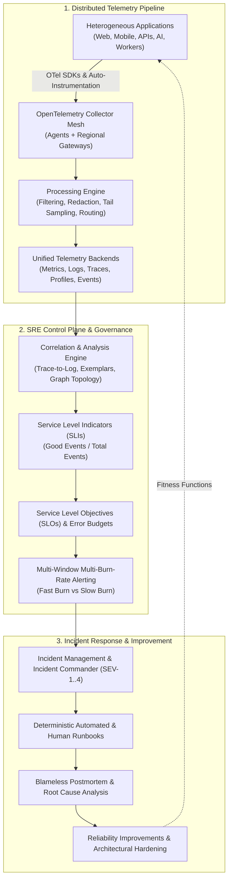

# 11. Observability, SRE & Operations Architecture

## Executive Summary

The `11-observability/` domain establishes the operational architecture, telemetry strategy, and Site Reliability Engineering (SRE) operating system required to observe, operate, troubleshoot, and continuously improve mission-critical enterprise systems across heterogeneous distributed environments.

Modern distributed architectures (microservices, event streams, serverless, modular monoliths, multi-region hybrid clouds, and AI/LLM pipelines) fail in non-deterministic, emergent ways. **Monitoring tells you when a known symptom occurs; Observability allows you to infer the internal state of a system based on its external outputs to answer unknown questions; SRE provides the engineering discipline to balance reliability against product velocity economically.**



---

## The Core Mental Model: Monitoring vs Observability vs SRE

| Discipline | Core Inquiry | Fundamental Nature | Telemetry Focus | Architectural Outcome |
| :--- | :--- | :--- | :--- | :--- |
| **Monitoring** | *"Is the system working?"* | **Known unknowns** & threshold checks | Aggregated metrics, uptime pings, CPU/memory thresholds | Detects known failure modes and breaches of static limits. |
| **Observability** | *"Why is the system behaving this way?"* | **Unknown unknowns** & exploratory debugging | High-cardinality traces, structured logs, exemplars, profiles | Enables arbitrary slicing and investigation without code redeployment. |
| **Site Reliability Engineering** | *"How reliable should it be, and how do we operate it sustainably?"* | **Engineering discipline** governing operational trade-offs | SLIs, SLOs, error budgets, toil metrics, burn rates | Aligns business risk with feature delivery velocity and cost economics. |

---

## Telemetry to Operational Action Pipeline

```
Telemetry (Metrics, Logs, Traces, Profiles, Events)
       ↓
Observability Platform (Collection, Enrichment, Ingestion)
       ↓
Analysis & Correlation (Exemplars, Topologies, Aggregations)
       ↓
SLIs / SLOs / Error Budgets (Business-Aligned Quality Thresholds)
       ↓
Multi-Window Burn-Rate Alerts (Symptom-Driven Paging)
       ↓
Incident Response & Incident Commander (SEV-1 to SEV-4)
       ↓
Blameless Post-Mortem & 5-Whys Analysis
       ↓
Reliability Engineering & Architectural Hardening (Continuous Loop)
```

---

## Domain Directory Index

### Root Foundation & Governance
* **[`observability-principles.md`](observability-principles.md)** — 15 Non-negotiable architectural principles for observability and reliability.
* **[`observability-architecture.md`](observability-architecture.md)** — Canonical enterprise observability pipeline reference architecture.
* **[`telemetry-strategy.md`](telemetry-strategy.md)** — Comprehensive strategy for metrics, logs, traces, profiles, and events.
* **[`sre-operating-model.md`](sre-operating-model.md)** — Team topologies, service ownership, on-call models, and toil management.
* **[`sli-slo-framework.md`](sli-slo-framework.md)** — Mathematical formulations for SLIs, SLO tiers, and composite user journeys.
* **[`error-budget-policy.md`](error-budget-policy.md)** — Error budget consumption, burn rate escalation, release freezes, and governance.
* **[`incident-management.md`](incident-management.md)** — Lifecycle from detection to stabilization, Incident Commander hierarchy, and severity.
* **[`production-readiness.md`](production-readiness.md)** — 6-Dimension Production Readiness Review (PRR) gates and operational checklists.
* **[`observability-checklist.md`](observability-checklist.md)** — Master 50-point enterprise observability architectural audit.

### Core Telemetry Disciplines
* **[`opentelemetry/`](opentelemetry/README.md)** — OpenTelemetry SDKs, Collector mesh, agent/gateway topology, context propagation, sampling, and governance.
* **[`metrics/`](metrics/README.md)** — Metric types, RED and USE methods, Four Golden Signals, business telemetry, cardinality control, and aggregation.
* **[`logging/`](logging/README.md)** — Structured JSON logging, severity levels, distributed correlation, tiered retention, privacy (PII masking), and security.
* **[`tracing/`](tracing/README.md)** — Distributed trace models, W3C context propagation, asynchronous messaging tracing, trace-based testing, and tail sampling.
* **[`alerting/`](alerting/README.md)** — Alerting philosophy, multi-window multi-burn-rate alerting, error budget alerts, paging severity, routing, and alert fatigue elimination.
* **[`monitoring/`](monitoring/README.md)** — Full-stack monitoring: infrastructure, applications, databases, message brokers, health endpoints, synthetics, RUM, APM, mobile, cloud, and AI.

### Supporting Operational Disciplines
* [`sre/`](sre/README.md) — SRE foundations, SLA/SLO/SLI architecture, and toil automation.
* [`reliability-engineering/`](reliability-engineering/README.md) — Circuit breakers, bulkheads, load shedding, backpressure, and chaos engineering.
* [`runbooks/`](runbooks/README.md) — Production runbooks for database failover, Kafka lag, OOM leaks, and certificate expirations.
* [`problem-management/`](problem-management/README.md) — RCA techniques (5 Whys, Fishbone, Fault Tree) and Known Error Database (KEDB).
* [`change-management/`](change-management/README.md) — Standard, Normal, and Emergency change governance via GitOps.
* [`release-management/`](release-management/README.md) — Progressive delivery, canaries, and database backward compatibility.
* [`backup-recovery/`](backup-recovery/README.md) — Immutable WORM backups, restore testing drills, and RPO/RTO validation.
* [`business-continuity/`](business-continuity/README.md) — Business Impact Analysis (BIA) and multi-region disaster recovery operations.
