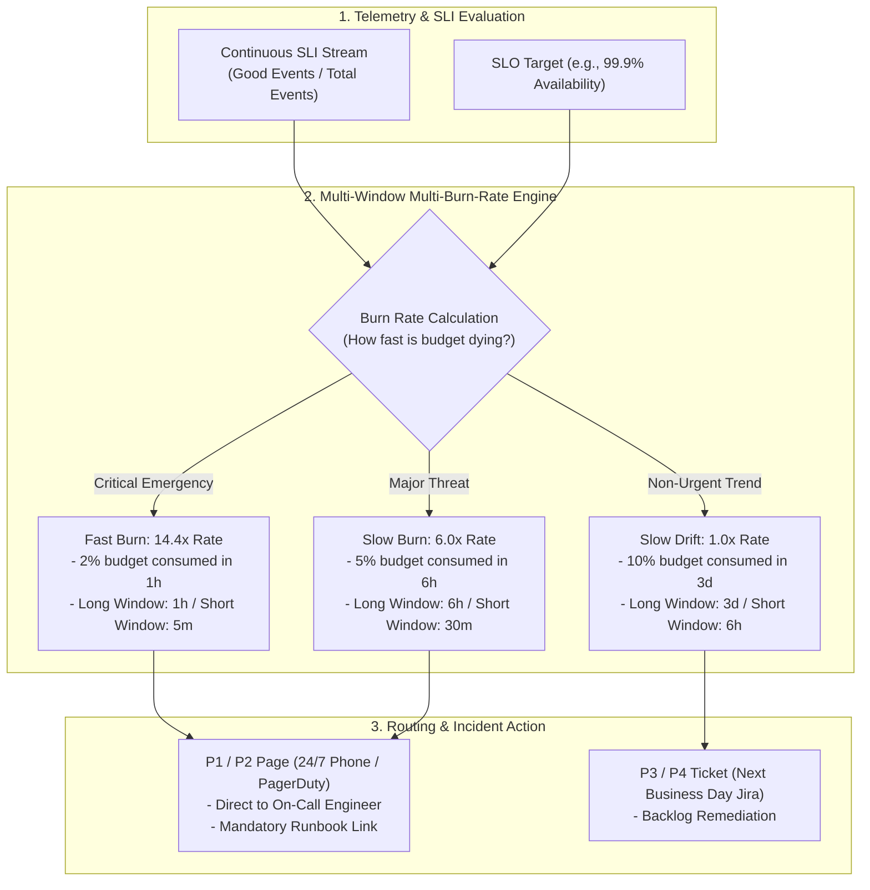

# Enterprise Alerting Architecture & SRE Engineering

## Executive Summary

Alerting is the operational mechanism that summons human beings to intervene when software systems fail. In an enterprise system, poorly designed alerts generate **alert fatigue**—a dangerous psychological condition where engineers become desensitized to pages, resulting in real outages being ignored.

Modern SRE alerting rejects static threshold alerts (e.g., "CPU > 80% for 5 minutes"). Instead, it enforces **Symptom-Driven Multi-Window Multi-Burn-Rate Alerting** based directly on Service Level Objectives (SLOs) and Error Budget consumption rates.

---

## Directory Index

| Document | Architectural Focus |
| :--- | :--- |
| **[`alerting-philosophy.md`](alerting-philosophy.md)** | Core principles: Alert on symptoms not causes; every page actionable; eliminate noise. |
| **[`multi-window-multi-burn-rate.md`](multi-window-multi-burn-rate.md)** | Google SRE alerting algorithm: mathematical formulas, window sizing, and production PromQL rules. |
| **[`error-budget-alerts.md`](error-budget-alerts.md)** | Error budget exhaustion rates: 2% in 1h, 5% in 6h, 10% in 3 days, and governance triggers. |
| **[`alert-severity.md`](alert-severity.md)** | P1/Critical (24/7 Page), P2/Major (Waking Hours Page), P3/Moderate (Ticket), P4/Low (Log/Info). |
| **[`routing-escalation.md`](routing-escalation.md)** | Dynamic routing, PagerDuty/Opsgenie integrations, multi-tiered escalation, and fallback schedules. |
| **[`alert-fatigue.md`](alert-fatigue.md)** | Mitigating fatigue: alert deduplication, dependency tree silencing, flapping detection, and volume budgets. |
| **[`runbook-integration.md`](runbook-integration.md)** | Runbook architecture: linking alerts to deterministic human and automated triage playbooks. |
| **[`anti-patterns.md`](anti-patterns.md)** | 12 Lethal alerting anti-patterns (static CPU alerts, flapping alerts, un-runbooked pages, alert storms). |
| **[`checklists/alerting-architecture-checklist.md`](checklists/alerting-architecture-checklist.md)** | 25-Point practical audit checklist for alerting system design and operational readiness. |
