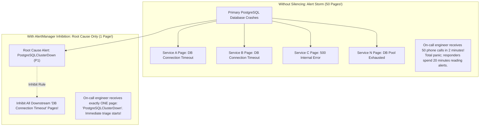

# Alert Fatigue Elimination: Deduplication, Grouping & Silencing

## 1. Executive Summary
**Alert Fatigue** is the single greatest hazard to enterprise site reliability. When an engineer receives 50 pages per week, they naturally begin ignoring alarms, missing the one critical page that precedes a catastrophic customer outage.

An enterprise alerting architecture must actively suppress noise through **Deduplication**, **Topological Grouping**, and **Dependency-Aware Silencing**.

---

## 2. The Cascading Alert Storm Problem

When a core network switch or primary database fails, 50 dependent microservices immediately fail to connect, triggering 50 separate paging alerts:



---

## 3. Production AlertManager Grouping & Inhibition Rules

```yaml
# /etc/alertmanager/config.yaml
route:
  group_by: [ 'alertname', 'cluster', 'service' ]
  group_wait: 30s        # Wait 30s to buffer related alerts before paging
  group_interval: 5m     # Batch additional incoming related alerts
  repeat_interval: 4h    # Do not re-page acknowledged active alerts for 4 hours

# INHIBITION RULES: Mute symptoms when root cause is already firing
inhibit_rules:
  # Rule 1: If an entire Kubernetes Node is down, mute pod-level crash alerts on that node
  - source_match:
      alertname: 'NodeNetworkInterfaceDown'
    target_match:
      alertname: 'InstanceDown'
    equal: [ 'node', 'instance' ]

  # Rule 2: If the primary database is down, mute downstream application connection timeouts
  - source_match:
      alertname: 'PostgreSQLClusterDown'
    target_match:
      alertname: 'DatabaseConnectionPoolExhausted'
    equal: [ 'environment', 'region' ]
```

---

## 4. Alert Flapping Detection & Hysteresis

**Flapping** occurs when a metric oscillates around a static threshold (e.g., CPU bounces between 79% and 81% every 30 seconds), causing an alert to repeatedly fire, resolve, and re-fire.

### Remediation: Alert Hysteresis
1. **Prometheus `for` Clause**: Require the condition to hold continuously for a duration before firing:
   ```yaml
   for: 5m  # Must be breached for 5 consecutive minutes
   ```
2. **Asymmetric Thresholds**: Require a significantly healthier value to resolve than to fire:
   - **Fire Alert**: When Memory Usage $> 85\%$.
   - **Resolve Alert**: Only when Memory Usage drops below $< 70\%$.
