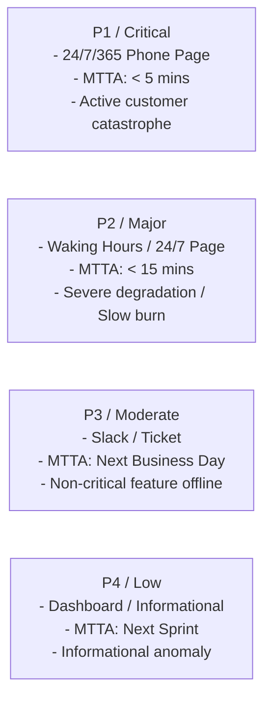

# Alert Severity Tiers & Paging Governance

## 1. Executive Summary
Assigning inappropriate severity levels to alerts is the primary cause of on-call burnout. If an alert does not require an immediate, adrenaline-fueled response, it must not be labeled `Critical` or routed to a phone pager.

This document establishes the four immutable enterprise alert severity tiers.

---

## 2. The 4 Enterprise Severity Tiers

| Severity Tier | Notification Channel | Response SLA (MTTA) | When to Use | Example Condition |
| :--- | :--- | :--- | :--- | :--- |
| **P1 (Critical)** | Phone Call + SMS + PagerDuty High Urgency blast | **$< 5$ Minutes (24/7/365)** | Core user journey paralyzed; error budget fast burn ($14.4\times$); data corruption. | Checkout returning 500s; Payment gateway unresponsive; Core banking ledger locked. |
| **P2 (Major)** | PagerDuty Mobile App Push + SMS | **$< 15$ Minutes** | Severe degradation with workaround; slow burn ($6.0\times$); redundancy lost (single node left). | Primary DB replica down (running on backup); recommendation engine offline; 2% error rate. |
| **P3 (Moderate)** | Slack Channel + Automated Jira Ticket | **Next Business Day (4 Hours)** | Internal service degraded; non-customer-facing utility broken; slow budget drift ($1.0\times$). | Admin portal slow; daily report delayed; batch reconciliation queue backlog growing slowly. |
| **P4 (Low)** | Dashboard Indicator / Daily Digest Email | **Next Sprint Planning** | Informational drift; capacity runway $< 60$ days; non-urgent anomaly. | Disk usage reached 70%; certificate expiring in 45 days; minor telemetry schema mismatch. |
