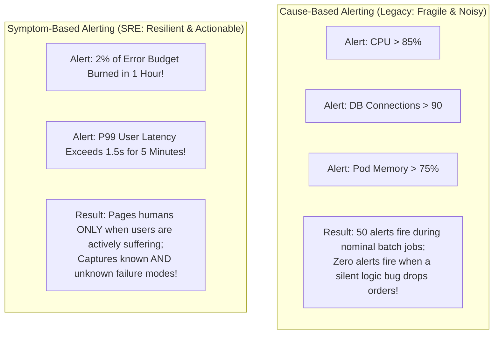

# The SRE Alerting Philosophy

## 1. Executive Summary
Traditional operations monitoring relies on **cause-based alerting**: guessing every possible failure mode (disk full, thread pool saturated, switch packet loss) and attaching a static threshold alert to each. In a distributed system, this approach fails because systems fail in unforeseen, emergent ways that static rules never anticipate.

SRE alerting relies on **symptom-based alerting**: monitoring user outcomes directly. If users are experiencing errors or extreme latency, page an engineer immediately, regardless of what component caused it.

---

## 2. Cause-Based vs Symptom-Based Alerting

---

## 3. The 4 Golden Rules of SRE Alerting

### Rule 1: Every Page Must Require Immediate Human Intervention
If an alert wakes an engineer up at 3:00 AM, and the engineer can simply click "Acknowledge" and go back to sleep until 9:00 AM, **that alert should never have been a page**. It belongs on a ticket or dashboard.

### Rule 2: Every Page Must Be Actionable
Every page must correspond to a clear operational playbook or deterministic remediation. An alert stating *"Network latency is high between Zone A and Zone B"* is not actionable if the cloud provider owns the network and engineers have no failover mechanism configured.

### Rule 3: No False Positives (Zero Tolerance for Alert Noise)
A system that pages engineers for transient spikes that resolve themselves in 2 minutes trains humans to ignore alerts. Alerts must enforce duration hysteresis and dual-window validation to guarantee that transient blips never page.

### Rule 4: Tie Alerting Directly to Business Risk
Systems exist to serve users and generate value. Alert urgency must be mathematically proportional to the rate at which user trust, contractual compliance, or company revenue is being consumed.
