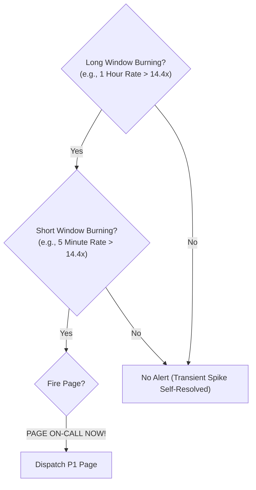

# Multi-Window Multi-Burn-Rate Alerting Architecture

## 1. Executive Summary
Documented in Chapter 5 of the Google SRE Workbook, **Multi-Window Multi-Burn-Rate Alerting** is the mathematical standard for alerting on Service Level Objectives. It completely eliminates the trade-offs of traditional alerting:
- It eliminates **reset delays** (noticing an outage quickly).
- It eliminates **alert storms** (false alarms from brief spikes).
- It catches both **catastrophic outages** (fast burn) and **slow insidious degradation** (slow burn).

---

## 2. Mathematical Definition of Burn Rate

**Burn Rate** ($B$) is the rate at which a system consumes its error budget relative to its nominal target:
- $B = 1$: The system consumes exactly 100% of its error budget over the entire evaluation period (e.g., 30 days). **Zero alert required**.
- $B = 2$: The system consumes 100% of its error budget in 15 days.
- $B = 14.4$: The system consumes **2% of its entire 30-day error budget in just 1 hour**. **Immediate P1 Page Required!**

$$\text{Burn Rate} = \frac{\text{Actual Error Rate}}{1 - \text{SLO Target}}$$

---

## 3. The Multi-Window Multi-Burn-Rate Matrix

To avoid alerting on brief spikes that self-heal, the algorithm requires that **both a long window AND a short window** are burning simultaneously before firing an alert:



| Burn Rate | % Budget Consumed | Time to 100% Exhaustion | Long Window | Short Window | Action & Severity |
| :--- | :--- | :--- | :--- | :--- | :--- |
| **$14.4\times$** | **$2.0\%$** in 1 Hour | 2.1 Days | **1 Hour** | **5 Minutes** | **P1 Critical Page (Immediate 24/7)** |
| **$6.0\times$** | **$5.0\%$** in 6 Hours | 5.0 Days | **6 Hours** | **30 Minutes** | **P2 Major Page (24/7)** |
| **$3.0\times$** | **$10.0\%$** in 24 Hours | 10.0 Days | **24 Hours** | **2 Hours** | **P2 Page (Waking Hours)** |
| **$1.0\times$** | **$10.0\%$** in 3 Days | 30.0 Days | **3 Days** | **6 Hours** | **P3 Jira Ticket (Next Business Day)** |

---

## 4. Production Prometheus / AlertManager Rule Spec

```yaml
# /etc/prometheus/rules/slo_burn_rate_alerts.yaml
groups:
  - name: checkout_service_slo_alerts
    rules:
      # Pre-computed error rates over short and long windows
      - record: job:http_errors:rate5m
        expr: sum(rate(http_requests_total{job="checkout", status=~"5.."}[5m])) / sum(rate(http_requests_total{job="checkout"}[5m]))
      - record: job:http_errors:rate1h
        expr: sum(rate(http_requests_total{job="checkout", status=~"5.."}[1h])) / sum(rate(http_requests_total{job="checkout"}[1h]))
      - record: job:http_errors:rate30m
        expr: sum(rate(http_requests_total{job="checkout", status=~"5.."}[30m])) / sum(rate(http_requests_total{job="checkout"}[30m]))
      - record: job:http_errors:rate6h
        expr: sum(rate(http_requests_total{job="checkout", status=~"5.."}[6h])) / sum(rate(http_requests_total{job="checkout"}[6h]))

      # ALERT 1: Fast Burn Rate (14.4x) -> Consumes 2% budget in 1 hour -> PAGE IMMEDIATELY
      # For SLO 99.9%, 1 - SLO = 0.001. Threshold = 14.4 * 0.001 = 0.0144 (1.44% error rate)
      - alert: CheckoutServiceHighErrorBudgetBurnRateFast
        expr: >
          (job:http_errors:rate1h > (14.4 * 0.001))
          and
          (job:http_errors:rate5m > (14.4 * 0.001))
        for: 2m
        labels:
          severity: critical
          tier: tier-1
          pager: pagerduty
        annotations:
          summary: "Checkout Service burning error budget at 14.4x rate (Fast Burn)"
          description: "2% of the monthly error budget consumed in the last hour. Immediate intervention required."
          runbook_url: "https://runbooks.enterprise.com/checkout/high-error-rate"

      # ALERT 2: Slow Burn Rate (6.0x) -> Consumes 5% budget in 6 hours -> PAGE
      # Threshold = 6.0 * 0.001 = 0.006 (0.6% error rate)
      - alert: CheckoutServiceHighErrorBudgetBurnRateSlow
        expr: >
          (job:http_errors:rate6h > (6.0 * 0.001))
          and
          (job:http_errors:rate30m > (6.0 * 0.001))
        for: 15m
        labels:
          severity: major
          tier: tier-1
          pager: pagerduty
        annotations:
          summary: "Checkout Service burning error budget at 6.0x rate (Slow Burn)"
          description: "5% of monthly error budget consumed in 6 hours. System will exhaust budget in 5 days if unmitigated."
          runbook_url: "https://runbooks.enterprise.com/checkout/high-error-rate"
```
