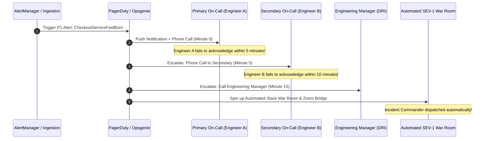

# Alert Routing, Escalation Trees & On-Call Handoff

## 1. Executive Summary
Routing an alert to a generic company-wide `#alerts` Slack channel is equivalent to sending it to `/dev/null`. If everyone owns an alert, **no one owns it**.

Enterprise alert routing mandates deterministic, dynamic routing based on **Service Catalog Ownership**, automated escalation ladders, and resilient fallback schedules.

---

## 2. Dynamic Routing & Multi-Tiered Escalation Topology

---

## 3. Escalation Rules & Fallback Mechanics

1. **The 5-Minute Acknowledgment SLA**: For P1 alerts, the primary on-call engineer has exactly **5 minutes** to acknowledge the page. If unacknowledged, PagerDuty automatically escalates to the secondary.
2. **The Catch-All Fallback Schedule**: If both primary and secondary fail to acknowledge after 15 minutes, the alert escalates to the **Platform SRE Duty Lead** and the **Domain Engineering Director**.
3. **Escalation Policy Ownership**:
   - Product squads maintain their own primary and secondary rotations.
   - Central SRE platform maintains the catch-all rotation.
   - Rotations must have at least 6 engineers to maintain sustainable lifestyle balance.
