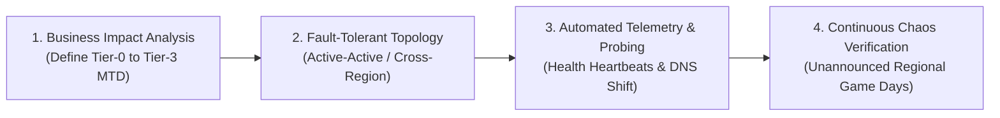

# Enterprise Business Continuity & Disaster Recovery Operations

## Executive Summary

Business Continuity Planning (BCP) and Disaster Recovery (DR) ensure that mission-critical enterprise systems survive catastrophic disruptions—such as regional cloud provider outages, major cyberattacks, fiber cuts, or facility destructions—with minimal operational disruption and zero permanent data loss.

In modern enterprise architectures, Business Continuity is tightly integrated with Observability, Automated Chaos Engineering, and Continuous Failover Verification.

---

## Architectural Taxonomy & Core Documents

| Architectural Domain | Document Link | Core Focus & Artifacts |
| :--- | :--- | :--- |
| **Business Continuity Operations** | [`business-continuity-operations.md`](business-continuity-operations.md) | Business Impact Analysis (BIA), Maximum Tolerable Downtime (MTD), RTO/RPO tiering, and active failover execution runbooks. |
| **Chaos Game Days** | [`../checklists/11-chaos-game-day-observability.md`](../checklists/11-chaos-game-day-observability.md) | Validation of telemetry and recovery runbooks under intentional destructive chaos testing. |
| **High Availability Architecture** | [`../reference-architectures/04-hybrid-cloud.md`](../reference-architectures/04-hybrid-cloud.md) | Multi-region, hybrid active-passive, and active-active failover topologies. |

---

## The Resiliency Equation

Enterprise continuity rests on four interlocking architectural guardrails:

1. **RTO (Recovery Time Objective)**: The maximum permissible elapsed time from incident onset to service restoration.
2. **RPO (Recovery Point Objective)**: The maximum permissible age of data that can be lost when recovery occurs (e.g., database replication lag).
3. **MTD (Maximum Tolerable Downtime)**: The absolute temporal deadline beyond which business viability suffers irreversible harm.
