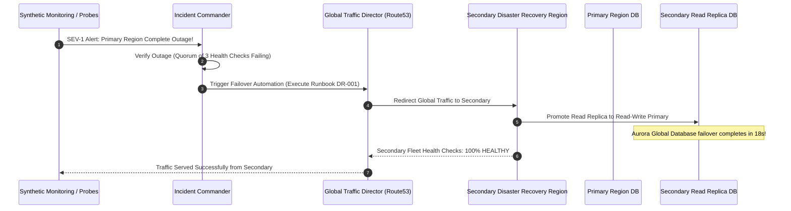

# Business Continuity Operations & Disaster Recovery Execution

## 1. Executive Summary
A comprehensive operational framework detailing Business Impact Analysis (BIA), service tiering, Recovery Time Objective (RTO) and Recovery Point Objective (RPO) guarantees, and multi-region failover automation.

---

## 2. Enterprise Service Tiering & Recovery Targets

```mermaid
quadrantChart
    title Enterprise Service Criticality vs Recovery Targets
    x-axis Lenient Recovery Time --> Aggressive Real-Time RTO
    y-axis Non-Critical Data --> Zero RPO Tolerance
    quadrant-1 Tier 0: Core Banking & Auth
    quadrant-2 Tier 1: Order Processing & Billing
    quadrant-3 Tier 3: Internal Analytics & BI
    quadrant-4 Tier 2: Email & Notification Services
    "Core Ledger": [0.95, 0.98]
    "User Authentication": [0.92, 0.90]
    "Payment Gateway": [0.88, 0.95]
    "Inventory Search": [0.65, 0.70]
    "Analytics Lake": [0.20, 0.30]
    "Marketing Emails": [0.40, 0.20]
```

| Service Tier | Business Criticality | Maximum RTO | Maximum RPO | Deployment Topology | Failover Mechanism |
| :--- | :--- | :--- | :--- | :--- | :--- |
| **Tier 0** | Core Banking, Payment Auth, Identity | $< 30\text{ seconds}$ | $0\text{ (Zero Data Loss)}$ | Multi-Region Active-Active | Global Anycast DNS / Multi-Cloud Envoy mesh |
| **Tier 1** | Order Placement, Digital Checkout | $< 15\text{ minutes}$ | $< 60\text{ seconds}$ | Multi-Region Warm Standby | Automated Route53 / Cloudflare DNS shift |
| **Tier 2** | Notifications, Reporting Portals | $< 4\text{ hours}$ | $< 15\text{ minutes}$ | Pilot Light (Cross-Region Backup) | Infrastructure-as-Code (Terraform) re-spin |
| **Tier 3** | Internal Back-Office, Data Warehouse | $< 24\text{ hours}$ | $< 24\text{ hours}$ | Cold Storage (S3 Glacier / Object) | Batch restore from snapshot archives |

---

## 3. Disaster Declaration & Failover Execution Sequence



---

## 4. Operational Readiness Checklist
- [ ] Automated database promotion scripts tested in staging every 14 days.
- [ ] Global DNS TTL set to $\le 60\text{ seconds}$ for rapid traffic diversion.
- [ ] Secrets and KMS keys synchronized across primary and secondary recovery regions.
- [ ] Quarterly unannounced regional kill-switch game days conducted with on-call personnel.
