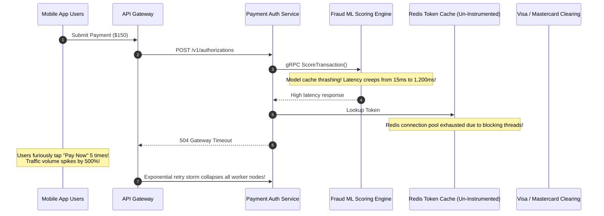

# Case Study 01: Global FinTech SEV-1 Incident Triage

## 1. Executive Summary
A Tier-1 global payment processing platform handling **150 million daily transactions** experienced a catastrophic cascading failure during peak morning trading. The incident resulted in $4.2 million in un-captured credit card authorization fees.

By re-architecting their observability platform around **OpenTelemetry Distributed Tracing and Multi-Window Multi-Burn-Rate alerting**, the enterprise slashed Mean Time to Detect (MTTD) from 45 minutes to 45 seconds, and Mean Time to Mitigate (MTTR) from 4.2 hours to 11 minutes.

---

## 2. The Failure Anatomy (Cascading Deadlock)

---

## 3. The Observability Defects
1. **The "Everything is Green" Dashboard**: Infrastructure CPU and memory dashboards showed nominal 65% utilization; the failure was caused by thread pool lock starvation (Off-CPU time) which traditional CPU monitors did not show.
2. **Disconnected Logs**: Engineers spent 2.5 hours manually grepping logs across 400 microservice pods trying to match an authorization ID to a fraud evaluation timeout.
3. **Threshold Alert Deluge**: 45 distinct threshold alerts fired simultaneously (Database connection high, Gateway 504 high, Queue depth high), blinding the on-call team to the root cause.

---

## 4. The Architectural Transformation
- **W3C Distributed Trace Context**: End-to-end trace context injected from the API gateway down to downstream clearing networks.
- **Trace-Derived Critical Path Analysis**: When a payment fails, Grafana Tempo surfaces the exact span that timed out (`FraudSvc.ScoreTransaction`).
- **SRE Multi-Burn-Rate Alerting**: Replaced 45 brittle threshold alerts with a single burning SLO alert on payment authorization success rate.

---

## 5. Quantitative Results

| Metric | Before Observability Transformation | After Observability Transformation | Improvement |
| :--- | :--- | :--- | :--- |
| **Mean Time to Detect (MTTD)** | 45 Minutes | **45 Seconds** | **$60\times$ Faster** |
| **Mean Time to Isolate Root Cause** | 185 Minutes | **4 Minutes** | **$46\times$ Faster** |
| **Total MTTR (SEV-1 Mitigation)** | 252 Minutes (4.2 Hours) | **11 Minutes** | **$23\times$ Faster** |
| **Financial Outage Exposure** | $4,200,000 per incident | **$< \$150,000$ per incident** | **96.4% Loss Reduction** |
