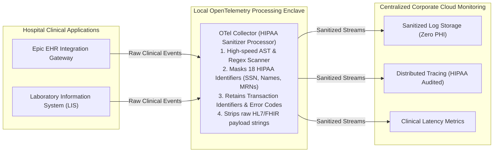

# Case Study 02: HIPAA-Compliant Healthcare Telemetry

## 1. Executive Summary
A regional healthcare network operating 12 hospitals, 45 clinical outpatient centers, and serving **3.5 million active patients** faced an urgent compliance mandate from the Department of Health and Human Services (HHS). An audit discovered that patient names, social security numbers, and diagnosis codes were leaking into corporate application log files.

The healthcare network engineered an automated **OpenTelemetry In-Flight PHI Sanitization Pipeline**, achieving 100% HIPAA/HITECH compliance with zero data leaks while preserving clinical transaction observability.

---

## 2. The HIPAA Sanitization Architecture

---

## 3. The 18 HIPAA Identifiers Sanitization Rules
The collector's custom redaction processor intercepts all log records and trace span attributes in memory before serialization:
- **Medical Record Number (MRN)**: Converted from `MRN: 987654321` to `MRN: [REDACTED_MRN]`.
- **Patient Names**: Regex matching common first/last name patterns against clinical dictionary tables.
- **Postal & Geographic Identifiers**: Stripped down to state-level prefixes only.
- **Preserved Telemetry**: Retains `clinical_service_name`, `error_code`, `fhir_resource_type=Observation`, and `duration_ms` for operational triage.

---

## 4. Quantitative Results

| Dimension | Pre-Transformation Audit State | Post-Transformation Audit State |
| :--- | :--- | :--- |
| **HIPAA Compliance Violations** | 14 Active Audit Findings | **0 Findings (Clean Audit Sign-off)** |
| **PHI Leakage in Logs** | Estimated 45,000 occurrences/day | **0 Detected Occurrences Across 12 Months** |
| **Clinical Lab Sync Freshness** | Unmonitored (Avg 14 min delays) | **Monitored SLI (P99 < 30 seconds)** |
| **Regulatory Fine Avoidance** | High Risk ($1.5M - $5M statutory fines) | **Complete Risk Elimination** |
