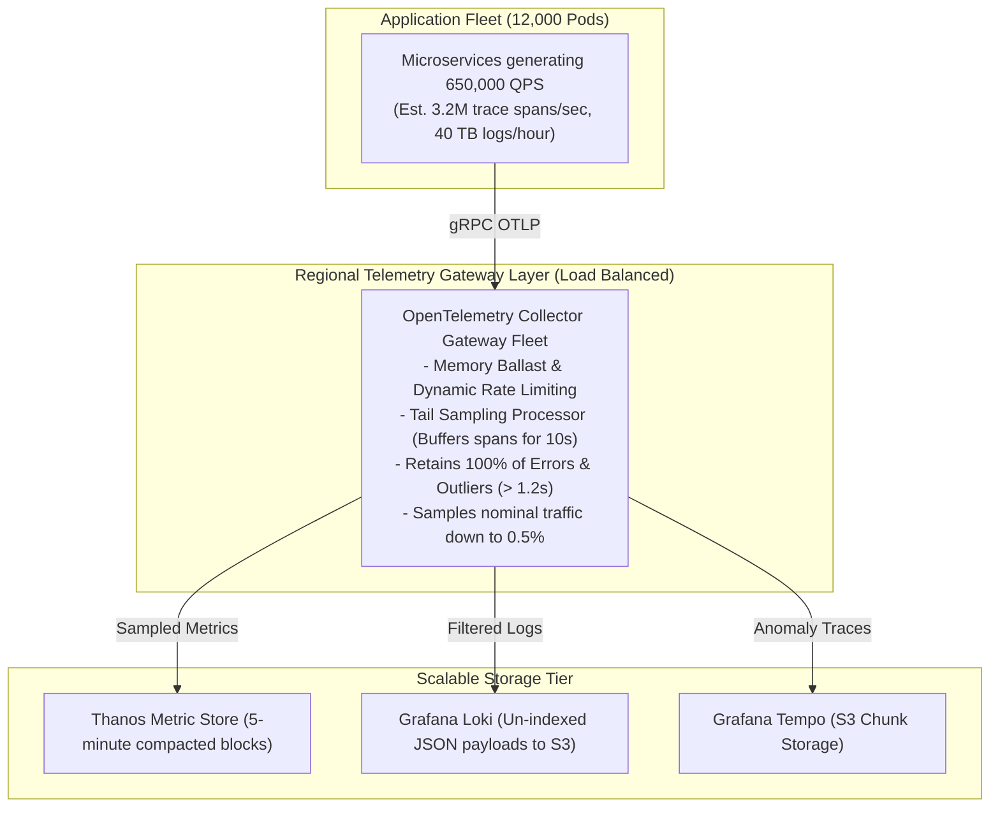

# Case Study 03: Black Friday Peak Traffic (650,000 QPS)

## 1. Executive Summary
A global e-commerce retail platform experiences an **$800\%$ traffic surge** every Black Friday / Cyber Monday, scaling from 80,000 QPS to **650,000 peak requests per second**. During prior peak events, the monitoring platform collapsed under the telemetry volume, leaving the entire engineering organization flying blind during critical revenue hours.

By deploying **Tail Sampling, OpenTelemetry Ingestion Gateways, and Dynamic Collector Backpressure**, the platform survived peak traffic with zero telemetry loss and maintained 100% dashboard uptime.

---

## 2. High-Scale Telemetry Ingestion Architecture

---

## 3. Key Operational Innovations
1. **Dynamic Memory Limiter**: Collectors configured with hard memory limits ($80\%$ max memory); under extreme spikes, collectors automatically shed low-priority trace spans while safeguarding critical RED metrics.
2. **Tail Sampling Filter Efficiency**: Reduced the incoming trace volume of 3.2 million spans/sec down to 45,000 high-value anomaly spans/sec (a **98.6% volume reduction** with zero loss of error visibility).
3. **Pre-Warmed Monitoring Clusters**: Prometheus and Thanos storage nodes were pre-scaled and compaction buffers expanded 72 hours prior to the shopping event.

---

## 4. Quantitative Results

| Dimension | Previous Year (Outage) | Current Year (Optimized Architecture) |
| :--- | :--- | :--- |
| **Peak Application QPS** | 420,000 QPS | **650,000 QPS** |
| **Monitoring System Availability** | 62% (Crashed for 3 hours) | **100% Uptime (Zero degradation)** |
| **Checkout Error Trace Capture** | 12% (Dropped under backpressure) | **100% of Checkout Errors Captured** |
| **Total Cloud Monitoring Cost Ratio** | 38% of total infrastructure spend | **14% of total infrastructure spend** |
