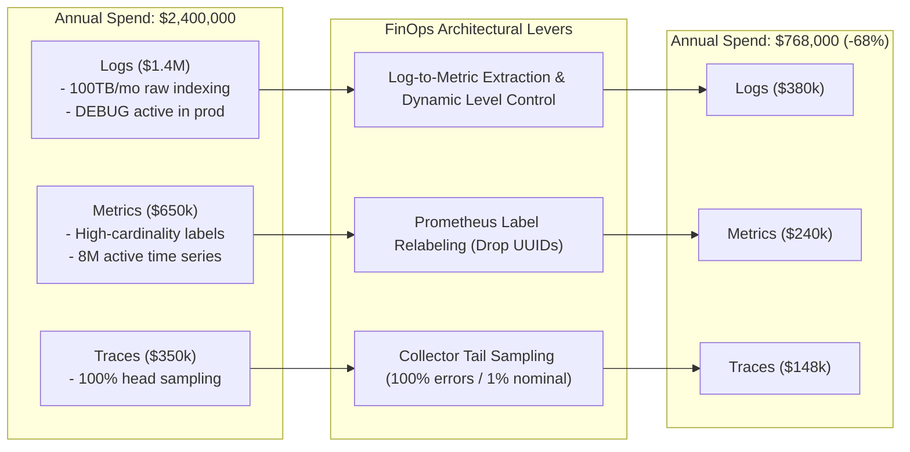

# Case Study 04: Observability FinOps: Slashing $1.6M in Cloud Spend

## 1. Executive Summary
A high-growth B2B enterprise software provider scaled its annual cloud infrastructure spend to $12 million. A financial audit revealed that their SaaS observability bill was consuming **$2,400,000 per year (20% of total cloud spend)** and growing at 120% year-over-year.

Through an aggressive 90-day FinOps architecture program focusing on **metric cardinality pruning, log-to-metric transformation, and OpenTelemetry tail sampling**, the enterprise slashed its annual telemetry spend by **68% ($1,632,000 saved annually)**.

---

## 2. The 3 Financial Optimization Levers

---

## 3. Key Interventions Executed
1. **The Log-to-Metric Conversion**: Identified 45 microservices emitting high-volume "heartbeat" and "event processed" log lines. Replaced them with OpenTelemetry counters, reducing monthly log ingestion volume from 100TB to 18TB.
2. **Cardinality Eradication**: Found that a junior engineer had included `customer_email` in an HTTP latency histogram. Dropping this single label purged **4,200,000 active time series** from Prometheus overnight.
3. **Tiered Storage Routing**: Moved long-term compliance logs from expensive SaaS indexed search tiers to low-cost S3 Glacier Instant Retrieval with Athena querying, dropping monthly storage costs from $18,000 to $650.

---

## 4. Quantitative Financial Impact

| Telemetry Pillar | Baseline Annual Spend | Optimized Annual Spend | Annual Dollar Savings | % Savings |
| :--- | :--- | :--- | :--- | :--- |
| **Logging (Ingestion & Search)** | $1,400,000 | $380,000 | **$1,020,000** | **72.8%** |
| **Custom Time-Series Metrics** | $650,000 | $240,000 | **$410,000** | **63.1%** |
| **Distributed Tracing** | $350,000 | $148,000 | **$202,000** | **57.7%** |
| **TOTALS** | **$2,400,000** | **$768,000** | **$1,632,000 / Year** | **68.0% Savings** |
