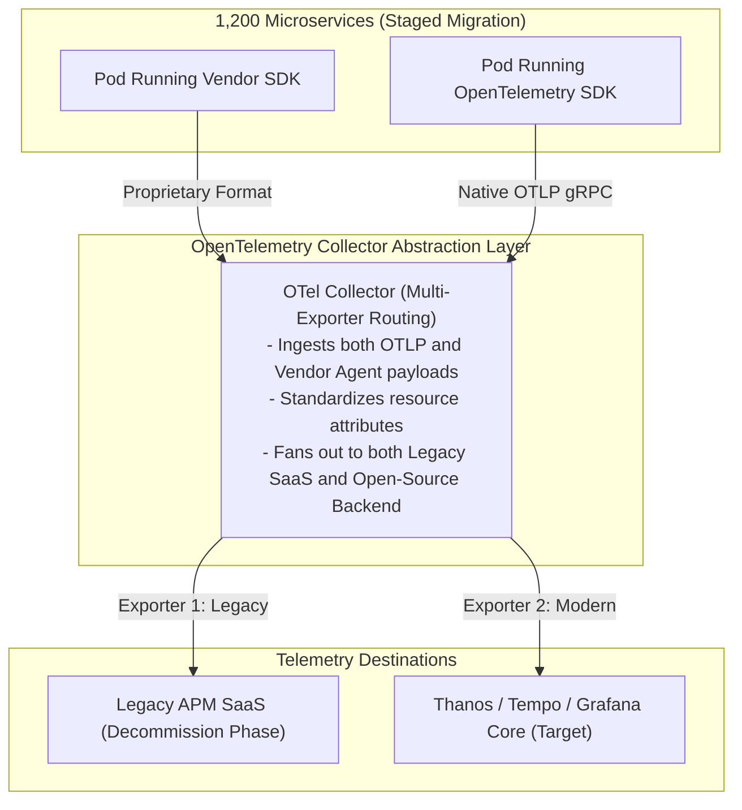

# Case Study 05: Migrating 1,200 Microservices to OpenTelemetry

## 1. Executive Summary
A multinational logistics corporation with **1,200 microservices** (written across Java, Go, Node.js, and .NET) was locked into a legacy proprietary APM vendor. The proprietary agents generated high runtime CPU overhead (4.5%), cost $4.8M annually, and blocked multi-cloud expansion.

The corporation executed a zero-downtime, staged migration to **OpenTelemetry (OTel)** over 9 months, achieving complete vendor neutrality and cutting agent CPU overhead by $75\%$.

---

## 2. The Dual-Routing Migration Architecture

---

## 3. The 4-Phase Migration Roadmap
1. **Phase 1: Collector Deployment (Month 1-2)**: Deploy OpenTelemetry Collectors as Kubernetes DaemonSets in all clusters. Configure collectors to forward telemetry to the legacy SaaS platform via vendor exporters.
2. **Phase 2: Golden Path Libraries (Month 3-4)**: Publish internal starter packages (`enterprise-otel-spring-boot-starter`, `enterprise-otel-go`) embedding corporate semantic conventions and tracing middleware.
3. **Phase 3: Squad-by-Squad Rollout (Month 5-7)**: Application squads swap dependencies during standard sprint releases. Zero code changes required for HTTP/gRPC handlers due to automatic instrumentation.
4. **Phase 4: Contract Termination (Month 8-9)**: Validate data parity across Grafana and legacy dashboards. Sever the legacy SaaS exporter and terminate the vendor contract.

---

## 4. Quantitative Results

| Operational Dimension | Legacy Proprietary APM | OpenTelemetry Architecture |
| :--- | :--- | :--- |
| **Agent CPU Overhead on Pods** | $4.2\% - 6.5\%$ | **$< 1.0\%$** |
| **Annual Software Licensing Cost** | $4,800,000 | **$0 (Open Source Standards)** |
| **Vendor Portability** | Completely locked into proprietary agent | **100% Vendor Neutral (Switch in Collector config)** |
| **Languages Supported** | 4 Supported Runtimes | **Polyglot (Java, Go, Node, .NET, Python, Rust)** |
