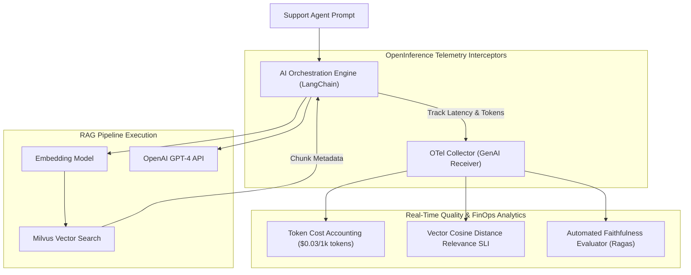

# Case Study 08: Enterprise AI Copilot LLMOps Observability

## 1. Executive Summary
A Fortune 500 enterprise launched an **Internal AI Customer Support Copilot** utilizing Retrieval-Augmented Generation (RAG) powered by OpenAI GPT-4, Milvus vector database, and LangChain. Within 6 weeks of launch, executive leadership noticed surging OpenAI API bills ($85,000/month) and increasing customer complaints regarding hallucinated return policies.

The enterprise engineered a comprehensive **LLMOps Observability Architecture**, cutting LLM token costs by 52% while establishing mathematical evaluation for retrieval relevance and hallucination detection.

---

## 2. LLMOps Telemetry Pipeline Architecture

---

## 3. Key Findings Uncovered by Observability
1. **The Runaway Context Window**: Tracing spans revealed that the vector search was retrieving 20 full policy documents (16,000 tokens) on every query, even for simple greetings like "Hello". Restricting vector retrieval to top-3 chunks with cosine similarity $> 0.82$ slashed token consumption by **$64\%$**.
2. **Semantic Drift Detection**: When the corporate HR portal updated its vacation policy, vector similarity scores dropped from 0.89 to 0.54, triggering an automated alert that vector embeddings were out of sync with the underlying document store.
3. **Prompt Injection Defense**: Interceptor telemetry logged and blocked 142 malicious prompt injection attempts aiming to leak internal confidential salary bands.

---

## 4. Quantitative Results

| LLMOps Metric | Before Observability | After Observability Architecture |
| :--- | :--- | :--- |
| **Monthly OpenAI Token Bill** | $85,400 / Month | **$41,200 / Month (51.8% Reduction)** |
| **Average Query Latency (P95)** | 4,800ms | **1,450ms (3.3x Speedup)** |
| **Hallucination / Faithfulness Rate** | Estimated 12.5% | **$< 1.0\%$ (Verified via Ragas automated scoring)** |
| **Vector Index Staleness MTTD** | Weeks (Discovered via user complaints) | **< 15 Minutes (Automated Drift Alerts)** |
