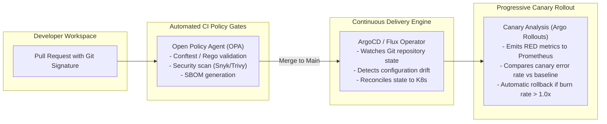

# Automated Change Governance & GitOps Delivery

## 1. Executive Summary
Traditional manual Change Advisory Boards (CAB) create catastrophic delivery friction, batching hundreds of changes into high-risk weekend releases. This document establishes **Automated Change Governance via GitOps**, replacing manual sign-offs with cryptographically signed commits, automated policy enforcement, and telemetry-driven canary analysis.

---

## 2. The Automated Change Architecture

---

## 3. Core Principles of Automated Change Governance

### 1. Git as the Single Source of Truth
No human possesses direct `kubectl` or SSH access to production environments. 100% of infrastructure, network, and application state is declared in version-controlled Git repositories.

### 2. Cryptographic Attestation & Provenance
Every deployment artifact must be accompanied by an in-toto attestation and cosign cryptographic signature linking container binaries directly to the verified source Git commit and CI run.

### 3. Progressive Canary Verification & Automated Rollback
Deployments execute in progressive increments (10% $\to$ 25% $\to$ 50% $\to$ 100%). At each stage, an automated analysis engine evaluates live Prometheus SLIs:
- If Canary Error Rate $\ge 0.5\%$, the rollout halts and aborts immediately in $< 10\text{ seconds}$.
- If Canary P99 Latency exceeds baseline by $> 20\%$, the traffic router diverts back to stable.

---

## 4. Governance Metrics & Verification
| Metric | Traditional CAB Baseline | Automated GitOps Target |
| :--- | :--- | :--- |
| **Change Lead Time** | 14 Days | **$< 30\text{ Minutes}$** |
| **Deployment Frequency** | Bi-Weekly Batch Releases | **Multiple Times per Day per Squad** |
| **Change Failure Rate (CFR)** | $18.5\%$ | **$< 1.5\%$** |
| **Mean Time to Recover (MTTR)** | 240 Minutes | **$< 3\text{ Minutes (Instant Git Revert)}$** |
