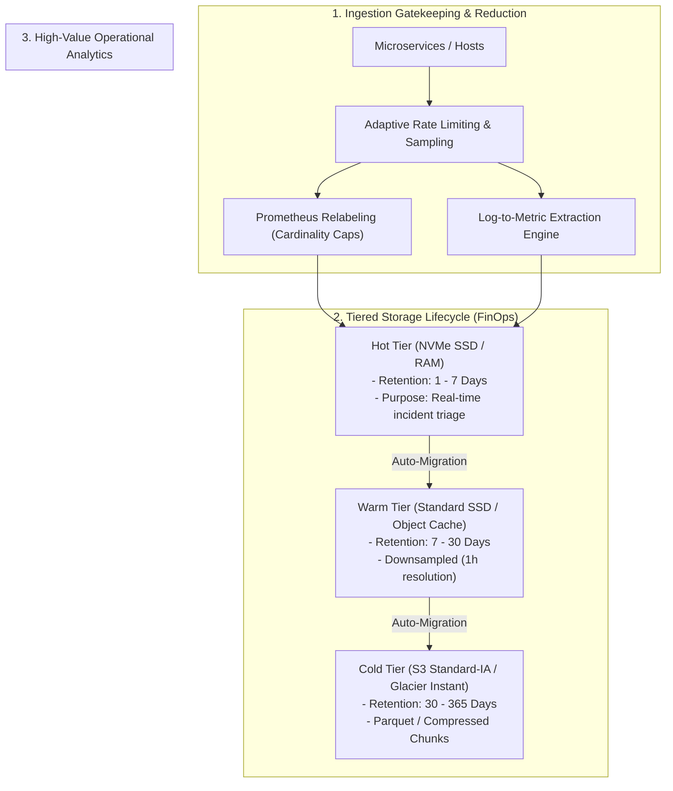

# Observability FinOps, Cost Engineering & Capacity Management

## Executive Summary

Observability has quietly become one of the largest line items on enterprise cloud bills, routinely consuming **15% to 35% of total cloud infrastructure spend**. Without rigorous architectural governance, observability costs scale linearly (or super-linearly) with transaction volume, while the actual operational value extracted plateaus.

Observability FinOps is the architectural discipline of **optimizing telemetry signal-to-noise ratio**: ensuring that every dollar spent on metrics, logs, traces, and profiles directly defends revenue, security, or compliance.

---

## Directory Index

| Document | Architectural Focus |
| :--- | :--- |
| **[`observability-costs.md`](observability-costs.md)** | Financial anatomy of telemetry: cost-per-gigabyte comparisons, SaaS billing traps, and vendor negotiation benchmarks. |
| **[`data-lifecycle.md`](data-lifecycle.md)** | Hot/Warm/Cold tiered storage architectures: downsampling algorithms, object storage archival, and retention governance. |
| **[`cardinality-management.md`](cardinality-management.md)** | Mitigating metric cardinality explosions: Prometheus relabeling, metric pruning, and M3DB/Thanos compaction. |
| **[`sampling-strategies.md`](sampling-strategies.md)** | Mathematical sampling: Head vs Tail sampling, adaptive rate-limiting, and error-biased probabilistic sampling. |
| **[`log-volume-reduction.md`](log-volume-reduction.md)** | Slashing log spend by 70%: log-to-metric transformation, payload stripping, and level enforcement. |
| **[`anti-patterns.md`](anti-patterns.md)** | 12 Lethal observability FinOps anti-patterns (storing debug logs in prod, indexing un-searched attributes, unbounded retention). |
| **[`checklists/observability-cost-checklist.md`](checklists/observability-cost-checklist.md)** | 25-Point practical audit checklist for telemetry cost optimization and capacity planning. |
