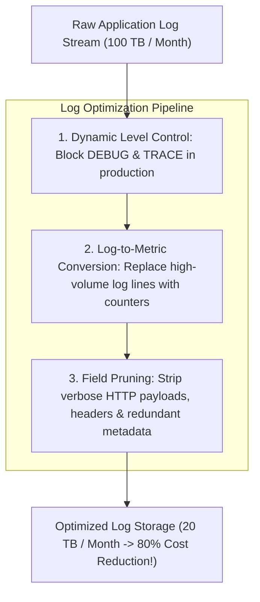

# Log Volume Reduction: Slashing Log Spend by 70%

## 1. Executive Summary
Logging is the single most expensive telemetry signal because it involves unstructured text, verbose serialization, and full-text inversion indexes. In most enterprises, **over 60% of logged lines are never queried by any human or automated system** before expiring.

Enterprise architecture achieves drastic log cost reductions through **Log-to-Metric Extraction**, **Field Stripping**, and **Dynamic Log Level Gating**.

---

## 2. The 3 Levers of Log Optimization



---

## 3. Log-to-Metric Extraction (The 100x Compression Lever)

A high-throughput API gateway processing 50,000 requests/sec frequently emits a log line for every request:
```json
{"timestamp":"2026-09-05T12:00:00Z","level":"INFO","event":"order_created","order_id":"123","amount":99.0,"status":"success"}
```
- **Cost to store as logs**: $50,000 \text{ logs/sec} \times 150 \text{ bytes} = 7.5\text{MB/sec} = \mathbf{19.4\text{ TB/month}}$ ($\approx \$40,000/\text{month}$ on SaaS).
- **Architectural Fix**: Transform the log event at the OpenTelemetry collector into a **Prometheus Counter**:
  ```
  order_creations_total{status="success"}
  ```
- **Cost to store as metric**: A single time-series sample updated every 15 seconds consumes **$< \$1.00/\text{month}$**.
- **Financial Result**: Identical operational analytical visibility achieved at **$1/40,000\text{th}$ of the cost**.
