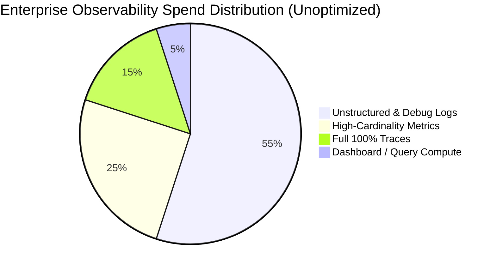

# The Financial Anatomy of Enterprise Observability

## 1. Executive Summary
In modern distributed architectures, telemetry volume frequently outgrows application payload volume. A 1KB checkout transaction can generate:
- 12KB of structured JSON logs across 6 microservices.
- 8KB of distributed trace spans across 20 downstream RPC calls.
- 50 discrete time-series metric samples.

When multiplied across 100,000 requests per minute, telemetry storage and ingestion can quickly exceed the infrastructure cost of running the application itself.

---

## 2. Telemetry Cost Profile Matrix

| Telemetry Pillar | Cost Driver | Average SaaS Cost Unit | Cost Optimization Lever |
| :--- | :--- | :--- | :--- |
| **Structured Logs** | Ingestion volume (GB/day) + Indexing storage | **$1.50 - $3.50 per GB ingested** | Log-to-metric conversion; drop DEBUG in prod; strip stack traces on known errors. |
| **Time-Series Metrics** | Active time series count + Sample frequency | **$0.10 - $0.35 per 1,000 custom metrics** | Prometheus relabeling; drop UUID/email labels; increase scrape intervals from 10s to 30s. |
| **Distributed Traces** | Total span count ingested | **$1.70 per 1M spans ingested** | Tail sampling (keep 100% errors + 1% successes); drop health-check spans. |
| **Continuous Profiles** | CPU core sampling volume | **$8.00 - $15.00 per host per month** | Statistical sampling at 19 Hz; profile aggregation before transmission. |

---

## 3. The 3 Hidden SaaS Observability Traps

1. **The "Custom Metric" Multiplying Surcharge**: SaaS vendors price base metrics affordably, but charge exorbitant penalties for "custom metrics" created when a developer adds an un-vetted label tag.
2. **Indexing Everything by Default**: Storing and indexing every single JSON field in Elasticsearch/OpenSearch inflates index storage by $300\%$ over raw compressed text.
3. **Data Egress Taxes**: Streaming uncompressed telemetry across cloud availability zones or out to third-party SaaS vendors incurs significant cloud inter-region egress network fees.
