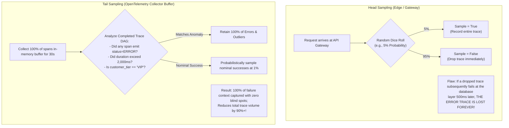

# Distributed Trace Sampling Strategies: Head vs Tail

## 1. Executive Summary
Storing 100% of distributed trace spans in an enterprise processing billions of requests per day is economically infeasible and operationally unnecessary. 99% of requests are nominal, low-latency successes that contain zero interesting diagnostic data.

Trace sampling is the architectural mechanism used to preserve **100% of high-value traces (errors, extreme latency, business VIPs)** while capturing just enough nominal traces to calculate baseline performance.

---

## 2. Head Sampling vs Tail Sampling



---

## 3. Tail Sampling Policy Configuration

```yaml
# /etc/otelcol-contrib/config.yaml
processors:
  tail_sampling:
    decision_wait: 10s       # Wait 10 seconds for all asynchronous spans to arrive
    num_traces: 50000        # In-memory buffer size
    expected_new_traces_per_sec: 2000
    policies:
      # POLICY 1: Preserve 100% of traces with errors
      - name: drop_or_keep_errors
        type: status_code
        status_code: { status_codes: [ ERROR ] }

      # POLICY 2: Preserve 100% of slow traces (> 1.5 seconds)
      - name: latency_outliers
        type: latency
        latency: { threshold_ms: 1500 }

      # POLICY 3: Drop 100% of health check probes
      - name: drop_health_checks
        type: string_attribute
        string_attribute:
          key: http.target
          values: [ "/healthz", "/ready", "/metrics" ]
          enabled_regex_matching: false
          invert_match: true

      # POLICY 4: Probabilistic sample of remaining nominal traces (1%)
      - name: probabilistic_nominal
        type: probabilistic
        probabilistic: { sampling_percentage: 1.0 }
```
