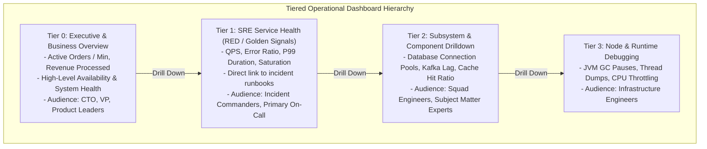

# Enterprise Dashboard Architecture & Visualization Engineering

## Executive Summary

A dashboard is an operational instrument, not decorative art. In an enterprise system, poorly structured dashboards create **cognitive overload**: during a major incident, responders are confronted with 40 chaotic, unorganized graphs with mismatched color schemes, slow query response times, and ambiguous labels, prolonging Mean Time to Resolution (MTTR).

Enterprise dashboard architecture enforces **strict visual hierarchy**, **Dashboard-as-Code (GitOps)**, **tiered audience separation**, and **optimized query execution**.

---

## Directory Index

| Document | Architectural Focus |
| :--- | :--- |
| **[`dashboard-design.md`](dashboard-design.md)** | Core visualization principles: Visual hierarchy, information density, semantic colors, and cognitive load reduction. |
| **[`dashboard-hierarchy.md`](dashboard-hierarchy.md)** | The 4-tier dashboard model: Executive -> SRE Service Health -> Subsystem Drilldown -> Node Debugging. |
| **[`grafana-architecture.md`](grafana-architecture.md)** | Grafana enterprise architecture: Multi-tenant orgs, RBAC, query caching, and Dashboard-as-Code (GitOps). |
| **[`anti-patterns.md`](anti-patterns.md)** | 12 Lethal dashboard anti-patterns (wall of gauges, un-templated queries, misleading Y-axes, sluggish queries). |
| **[`checklists/dashboard-architecture-checklist.md`](checklists/dashboard-architecture-checklist.md)** | 25-Point practical audit checklist for dashboard design, usability, and performance. |
