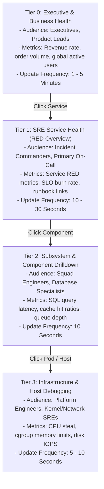

# The Enterprise Dashboard Hierarchy

## 1. Executive Summary
Enterprise architectures require a standardized four-tier dashboard navigation model. Every engineer, executive, and incident responder must know exactly which dashboard to open depending on the operational context.

---

## 2. The 4-Tier Operational Hierarchy

---

## 3. Tier Specifications

| Hierarchy Level | Primary Persona | Core Question Answered | Action Taken on Anomaly |
| :--- | :--- | :--- | :--- |
| **Tier 0: Business** | Executive Leadership | *"Is our business making money right now?"* | Executive communication; business disaster declaration. |
| **Tier 1: SRE / Service** | On-Call Engineers | *"Which user journey is broken and why did the page fire?"* | Roll back deployment; toggle feature flag; invoke runbook. |
| **Tier 2: Subsystem** | Software Developers | *"Which internal query, cache, or external API is failing?"* | Restart hung worker; scale connection pool; failover DB. |
| **Tier 3: Infrastructure** | Platform SREs | *"Is the physical or virtual host exhausted?"* | Cordon/drain Kubernetes node; increase pod CPU limits. |
