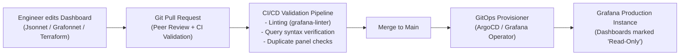

# Grafana Enterprise Architecture & Dashboard-as-Code

## 1. Executive Summary
Managing enterprise dashboards by manually clicking around in the Grafana web UI is an anti-pattern. Manual dashboards cannot be code-reviewed, have no audit history, diverge between staging and production, and can be accidentally deleted or corrupted by an errant click during an outage.

Enterprise architecture mandates **Dashboard-as-Code (DaC)**: all dashboards are authored in declarative code, version-controlled in Git, tested in CI/CD, and deployed via automated GitOps pipelines.

---

## 2. Dashboard-as-Code (GitOps) Pipeline



---

## 3. Tooling for Dashboard-as-Code

| Tooling Framework | Language / Format | Enterprise Pros | Enterprise Cons |
| :--- | :--- | :--- | :--- |
| **Grafonnet** (Jsonnet) | Jsonnet DSL | Highly reusable components; standard library for RED panels. | Requires learning Jsonnet syntax. |
| **Terraform Grafana Provider** | HCL | Native integration with corporate cloud IaC pipelines. | Bulky JSON embeddings in HCL resource blocks. |
| **Grafana Operator for K8s** | Kubernetes CRDs (`GrafanaDashboard`) | Direct GitOps sync via ArgoCD; lives next to service manifests. | Limited dynamic templating compared to Jsonnet. |

---

## 4. Production Declarative Dashboard Spec (Kubernetes CRD)

```yaml
# /deploy/monitoring/grafana-dashboard-checkout.yaml
apiVersion: grafana.integreatly.org/v1beta1
kind: GrafanaDashboard
metadata:
  name: checkout-service-red-dashboard
  namespace: monitoring
spec:
  instanceSelector:
    matchLabels:
      dashboards: "enterprise-production"
  folder: "Commerce Squad"
  json: |
    {
      "title": "Checkout Service: Tier-1 RED Overview",
      "tags": ["tier-1", "commerce", "red-metrics"],
      "timezone": "utc",
      "editable": false,
      "refresh": "30s",
      "time": { "from": "now-1h", "to": "now" },
      "templating": {
        "list": [
          {
            "name": "environment",
            "type": "query",
            "datasource": "Prometheus-Prod",
            "query": "label_values(http_requests_total, environment)",
            "current": { "text": "production", "value": "production" }
          },
          {
            "name": "route",
            "type": "query",
            "datasource": "Prometheus-Prod",
            "query": "label_values(http_requests_total{environment=\"$environment\"}, route)",
            "multi": true,
            "includeAll": true
          }
        ]
      },
      "panels": [
        {
          "id": 1,
          "title": "Request Throughput (QPS)",
          "type": "timeseries",
          "gridPos": { "h": 8, "w": 8, "x": 0, "y": 0 },
          "targets": [
            {
              "expr": "sum(rate(http_requests_total{environment=\"$environment\", route=~\"$route\"}[1m]))",
              "legendFormat": "Total QPS"
            }
          ]
        },
        {
          "id": 2,
          "title": "Error Ratio (%)",
          "type": "timeseries",
          "gridPos": { "h": 8, "w": 8, "x": 8, "y": 0 },
          "targets": [
            {
              "expr": "sum(rate(http_requests_total{environment=\"$environment\", status=~\"5..\"}[1m])) / sum(rate(http_requests_total{environment=\"$environment\"}[1m])) * 100",
              "legendFormat": "HTTP 5xx %"
            }
          ]
        },
        {
          "id": 3,
          "title": "P99 Latency Duration",
          "type": "timeseries",
          "gridPos": { "h": 8, "w": 8, "x": 16, "y": 0 },
          "targets": [
            {
              "expr": "histogram_quantile(0.99, sum by (le) (rate(http_request_duration_seconds_bucket{environment=\"$environment\"}[5m])))",
              "legendFormat": "P99 Latency (s)"
            }
          ]
        }
      ]
    }
```
