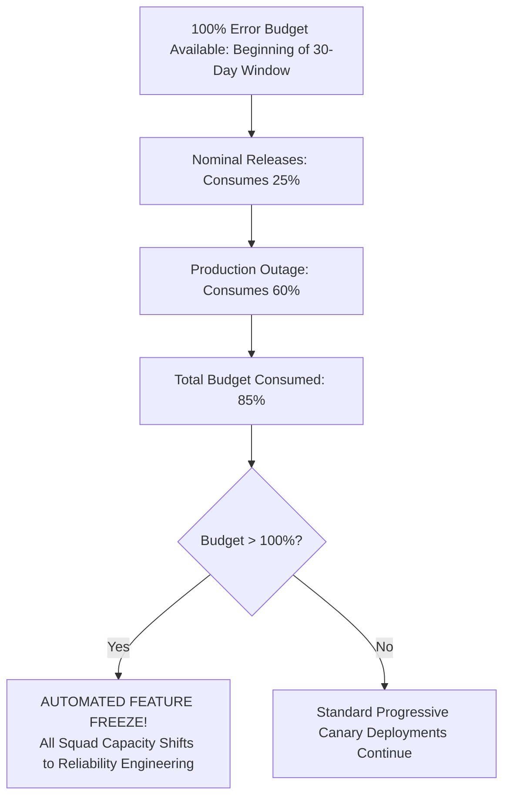

# Enterprise Error Budget Policy & Release Governance

## 1. Executive Summary
An Error Budget is the mathematical inverse of a Service Level Objective (SLO): $\text{Error Budget} = 100\% - \text{SLO}$. It represents the acceptable amount of unreliability a system can accumulate over a defined time window (typically 30 days or rolling quarter). **The Error Budget is not a margin of safety for lazy engineering; it is a shared currency between Product Management and Engineering to balance innovation velocity against operational stability.**

---

## 2. Mathematical Definition of Error Budget & Consumption

For a 30-day rolling window with an availability SLO of **99.9%** and $10,000,000$ total valid requests:

$$\text{Error Budget (Events)} = \text{Total Requests} \times (1 - \text{SLO}) = 10,000,000 \times 0.001 = 10,000 \text{ allowed bad events}$$

$$\text{Budget Consumed (\%)} = \frac{\text{Actual Bad Events}}{\text{Error Budget (Events)}} \times 100\%$$



---

## 3. Tiered Escalation Matrix Based on Budget Consumption

| Error Budget Remaining (Rolling 30-Day) | Operational Status | Release Policy & Velocity Impact | Engineering & Leadership Action Required |
| :--- | :--- | :--- | :--- |
| **$100\% - 50\%$ Remaining** | **Green (Healthy)** | Unrestricted feature deployments; normal canary velocity. | Standard CI/CD automated gates. Normal sprint operations. |
| **$49\% - 20\%$ Remaining** | **Yellow (Warning)** | Heightened canary scrutiny; canaries must soak for 2 hours. | Team reviews top error budget contributors during sprint retrospective. |
| **$19\% - 1\%$ Remaining** | **Orange (Critical)** | Releases restricted to low-risk bug fixes; architectural sign-off required. | SRE Lead and Product Owner meet daily to review burn rate; technical debt tickets prioritized. |
| **$\le 0\%$ (Budget Exhausted)** | **Red (Exhausted)** | **Mandatory Feature Freeze**: Zero new feature deployments permitted. | 100% of squad engineering capacity pivoted exclusively to reliability, technical debt, and PRR remediation. |

---

## 4. The Feature Freeze Governance Rules

When a service exhausts its error budget ($0\%$ budget remaining in the rolling 30-day window), the **Automated Feature Freeze Policy** takes effect immediately:

### Rule 1: Permitted Deployments During Freeze
During an active freeze, the deployment pipeline strictly rejects all feature branch merges. The *only* permissible production changes are:
1. **Critical Security Patches**: Addressing actively exploitable CVEs.
2. **P0/P1 Outage Hotfixes**: Required to restore system availability.
3. **Direct Reliability Improvements**: Changes explicitly designed to eliminate the root cause of the error budget exhaustion (e.g., connection pool tuning, circuit breaker addition, database indexing).

### Rule 2: Lifting the Freeze
A feature freeze cannot be lifted by product management request or executive whim. It is lifted under exactly two conditions:
- **Mathematical Recovery**: The 30-day rolling evaluation window naturally rolls forward, dropping the historical outage events, restoring $> 20\%$ of error budget.
- **Architectural Sign-Off (The Circuit Breaker Exception)**: The team demonstrates in staging via chaos testing that the structural root cause has been permanently eradicated, and both the **Lead SRE** and **VP of Engineering** provide written sign-off.

---

## 5. Executive Dispute Resolution & Exception Protocol

In rare commercial circumstances (e.g., contractual enterprise commitments, compliance regulatory deadlines), a business leader may demand to deploy a feature despite an exhausted error budget.

```
Product Leader Requests Exception
               │
               ▼
[Formal Risk Acceptance Form]
  - Quantifies: Current error budget deficit.
  - Predicts: Probability of additional outage during deployment ($P_{\text{outage}}$).
  - Calculates: Estimated financial risk ($) if system fails.
               │
               ▼
[Joint Executive Review: CPO & VP of Engineering]
  - Both executives must sign the formal Risk Acceptance artifact.
  - If signed: Deployment proceeds under direct Senior SRE supervision with instant rollback triggers.
  - If rejected: Feature remains frozen until reliability criteria are satisfied.
```
