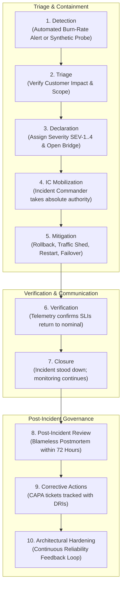

# Enterprise Incident Management & Incident Commander Operating System

## 1. Executive Summary
When mission-critical production systems degrade, confusion, distributed panic, and uncoordinated triage dramatically increase Mean Time to Resolution (MTTR). This document details the enterprise incident lifecycle, the **Incident Commander (IC)** command hierarchy, severity definitions, communication protocols, and the fundamental operational rule: **Restore service first; perform deep forensics after stabilization.**

---

## 2. The 10-Stage Incident Lifecycle



---

## 3. Incident Severity Classification Matrix

| Severity | Customer / Business Impact | Target MTTD | Target MTTR | Paging Urgency | Executive Escalation |
| :--- | :--- | :--- | :--- | :--- | :--- |
| **SEV-1 (Catastrophic)** | Total outage of critical customer journey (e.g., checkout offline, core payment rail paralyzed, data corruption). | $\le 2\text{ mins}$ | $\le 30\text{ mins}$ | Immediate 24/7/365 PagerDuty phone blast to primary + secondary + IC. | Immediate notification to CTO, CISO, VP Eng, and Legal within 15 mins. |
| **SEV-2 (Major)** | Severe degradation; high error rate ($> 5\%$) or major feature offline with partial workaround. | $\le 5\text{ mins}$ | $\le 60\text{ mins}$ | Immediate 24/7 PagerDuty page to squad on-call and SRE lead. | Engineering Director notified within 30 mins; hourly executive updates. |
| **SEV-3 (Moderate)** | Non-critical service failure; administrative dashboard broken; minimal end-user impact. | $\le 15\text{ mins}$ | $\le 4\text{ hours}$ | Business-hours page or Slack alert to owning squad on-call. | Squad Engineering Manager notified during business hours. |
| **SEV-4 (Minor)** | Minor bug, telemetry anomaly, or internal operational inefficiency with zero customer impact. | N/A | Next Sprint | Non-urgent Jira ticket created in backlog. | None. |

---

## 4. The Incident Command System (ICS) Roles

During a SEV-1 or SEV-2 incident, standard corporate hierarchy is temporarily dissolved. The **Incident Commander holds supreme operational authority**:

```
                  ┌───────────────────────────────┐
                  │   Incident Commander (IC)     │
                  │ - Holds sole command authority│
                  │ - Coordinates work, never fixes│
                  └───────────────┬───────────────┘
                                  │
         ┌────────────────────────┼────────────────────────┐
         ▼                        ▼                        ▼
┌───────────────────┐    ┌───────────────────┐    ┌───────────────────┐
│  Technical Lead   │    │Comms Lead (Scribe)│    │ Operations Lead   │
│ - Directs triage  │    │ - Manages Slack   │    │ - Executes runbook│
│ - Diagnoses code  │    │ - StatusPage post │    │   commands        │
│ - Subject Matter  │    │ - Executive brief │    │ - Applies traffic │
│   Expert (SME)    │    │ - Timestamps log  │    │   shedding/canary │
└───────────────────┘    └───────────────────┘    └───────────────────┘
```

### The Cardinal Rules of Incident Command
1. **The IC Does Not Debug**: The IC coordinates communication, assigns investigation hypotheses, and approves mitigations. If the IC begins inspecting logs, they lose situational awareness and must transfer the IC role to another engineer.
2. **One Voice on the Bridge**: Only the IC grants speaking rights on the audio bridge. Engineers do not debate opinions; they state verifiable telemetry facts.
3. **Hypothesis-Driven Triage**: The Technical Lead assigns explicit, time-boxed (10-minute) diagnostic tasks: *"Engineer A, check database connection acquisition latency. Engineer B, verify deployment diff between v2.4 and v2.5. Report back in 5 minutes."*

---

## 5. Mitigation vs Diagnosis

> **"Restore service first; understand root cause after."**

During an active outage, engineers frequently fall into the **Academic Trap**: attempting to understand the deep compiler or network packet reason why a service is failing. 
- **Correct SRE Behavior**: If rolling back to the previous container image restores user availability, **roll back immediately**.
- Preserve memory dumps, heap profiles, and network traces in a staging/scratch container for forensic analysis tomorrow. Never keep users suffering while attempting live forensic debugging.
