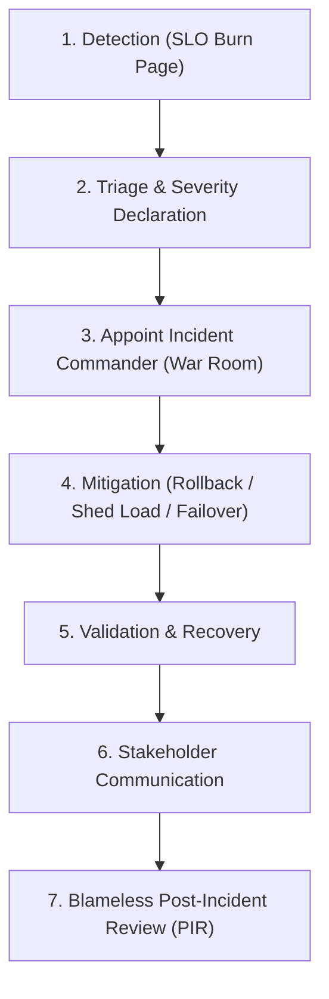

# Incident Management Lifecycle & Workflow

## Executive Summary

- **Mitigation vs Resolution**: During an active outage, the goal is **rapid mitigation** (stopping customer pain via rollback or traffic diversion), NOT finding the academic root cause. Investigation occurs after customer traffic is safe.
