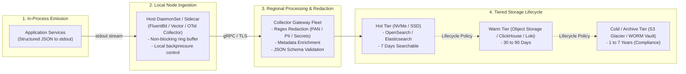

# Enterprise Logging Architecture & Governance

## Executive Summary

Logs are immutable, timestamped event records detailing discrete occurrences within an application or infrastructure runtime. While metrics detect *that* something is failing, structured logs provide the rich forensic context required to answer *why* it failed.

In an enterprise architecture generating billions of log records per day, raw unstructured text files (e.g., `app.log`) written to disk are obsolete. This directory documents the architecture of high-scale structured JSON logging, distributed context correlation, tiered lifecycle storage, sensitive data redaction (PII/PCI/HIPAA), and security audit trails.

---

## Directory Index

| Document | Architectural Focus |
| :--- | :--- |
| **[`structured-logging.md`](structured-logging.md)** | The Universal Enterprise JSON Log Schema: mandatory and optional fields, nesting, and validation. |
| **[`log-levels.md`](log-levels.md)** | Operational guidelines for TRACE, DEBUG, INFO, WARN, ERROR, FATAL, and dynamic runtime level switching. |
| **[`correlation.md`](correlation.md)** | Distributed context injection: correlating logs with active OpenTelemetry trace IDs and request IDs. |
| **[`routing.md`](routing.md)** | Ingestion pipelines, agent collectors, buffering, backpressure handling, and multi-destination routing. |
| **[`retention.md`](retention.md)** | Tiered storage architecture (Hot, Warm, Cold, Glacier/Archive), searchability, and compliance retention. |
| **[`privacy.md`](privacy.md)** | Sensitive data protection: Prevent, Detect, Redact, Mask, Hash, and Drop pipelines for PII/PCI/HIPAA. |
| **[`security.md`](security.md)** | Operational logs vs Security Telemetry vs Tamper-Evident Audit Trails (WORM, cryptographic signing). |
| **[`anti-patterns.md`](anti-patterns.md)** | 12 Lethal logging anti-patterns (logging credentials, raw request bodies, duplicate logging, etc.). |
| **[`checklists/logging-architecture-checklist.md`](checklists/logging-architecture-checklist.md)** | 25-Point practical audit checklist for enterprise logging architecture and privacy compliance. |

*(See also supporting deep-dives in [`../application-logging/`](../application-logging/README.md) for language-specific logging patterns).*
