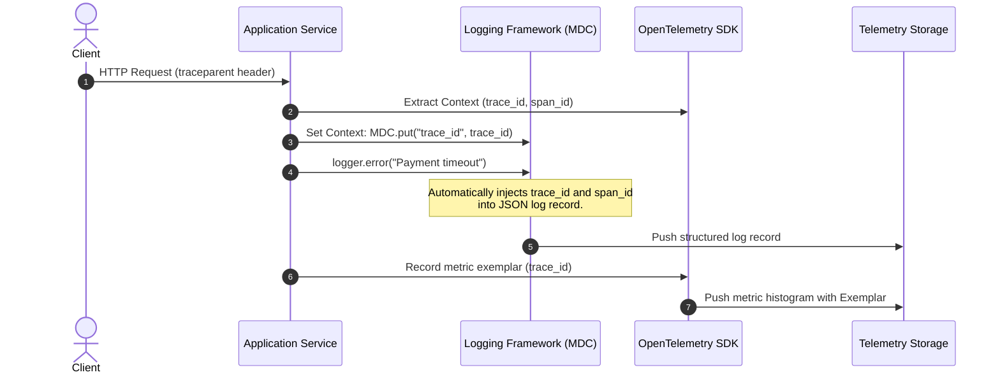

# Distributed Context Correlation Across Logs, Metrics & Traces

## 1. Executive Summary
In an enterprise distributed system, finding the single log line that explains an error among 500 million daily log records requires a deterministic link. **Distributed Context Correlation** binds structured logs directly to OpenTelemetry traces and Prometheus metrics via shared contextual identifiers.

---

## 2. The Universal Correlation Topology



---

## 3. The 4 Mandatory Correlation Keys

Every log record emitted during a transaction must contain:

| Correlation Key | Definition | Primary Purpose |
| :--- | :--- | :--- |
| **`trace_id`** | 128-bit W3C Trace ID | Correlates all logs across all microservices involved in the same end-to-end transaction. |
| **`span_id`** | 64-bit W3C Span ID | Isolates logs emitted during that exact local unit of work (e.g., a specific database query). |
| **`request_id`** | Client / Edge Request ID | Propagated from external clients to correlate client-side errors with edge load balancer logs. |
| **`tenant_id`** | Multi-tenant customer identifier | Allows filtering all operational telemetry for a specific enterprise customer during an escalation. |

---

## 4. Implementation in Enterprise Logging Frameworks

### Java (Logback / SLF4J with Logstash Encoder)
```xml
<!-- logback-spring.xml -->
<configuration>
    <appender name="JSON_STDOUT" class="ch.qos.logback.core.ConsoleAppender">
        <encoder class="net.logstash.logback.encoder.LogstashEncoder">
            <!-- Include Mapped Diagnostic Context (MDC) automatically -->
            <includeMdcKeyName>trace_id</includeMdcKeyName>
            <includeMdcKeyName>span_id</includeMdcKeyName>
            <includeMdcKeyName>tenant_id</includeMdcKeyName>
            <fieldNames>
                <timestamp>timestamp</timestamp>
                <level>severity</level>
            </fieldNames>
        </encoder>
    </appender>
    <root level="INFO">
        <appender-ref ref="JSON_STDOUT" />
    </root>
</configuration>
```

OpenTelemetry Java agent automatically injects `trace_id` and `span_id` into the SLF4J MDC context without any manual developer code.
