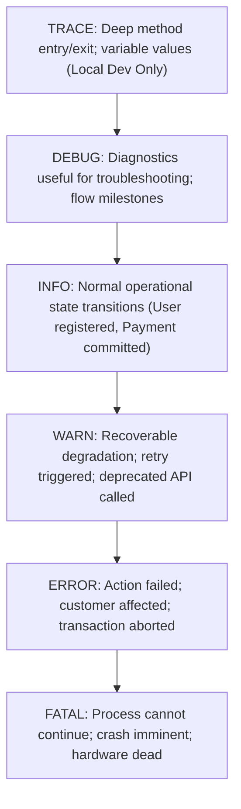

# Enterprise Log Level Standards & Dynamic Control

## 1. Executive Summary
Misconfigured log levels destroy system performance and cloud budgets. Setting production to `DEBUG` exhausts disk I/O and creates millions of dollars in ingestion charges; setting production to `ERROR` only makes root-cause analysis impossible.

This document establishes the enterprise definitions for the standard six log levels and the architecture for **Dynamic Runtime Log Level Switching**.

---

## 2. Standardized Log Level Definitions



| Log Level | Production Standard | Intended Audience | Example Operational Trigger |
| :--- | :--- | :--- | :--- |
| **TRACE** | **STRICTLY PROHIBITED** in production | Framework developers | Method entrance, byte buffer dumps, loop variable states. |
| **DEBUG** | Disabled by default in production | Engineers investigating known bugs | SQL queries executed, cache miss details, payload sizes. |
| **INFO** | **Enterprise Production Default** | SREs, developers, operators | Service started, user authentication successful, order placed. |
| **WARN** | Enabled in production | SREs and On-Call Engineers | Circuit breaker tripped, cache fallback used, high memory warning. |
| **ERROR** | Enabled in production; indexed | On-Call Engineers, Pagers | Database query failed, payment declined by timeout, 5xx returned. |
| **FATAL** | Enabled; triggers immediate SEV-1 | Incident Commander, Execs | Uncaught exception in main thread, database connection failed on boot. |

---

## 3. Dynamic Runtime Log Level Switching

Restarting a production service to change `logging.level=DEBUG` in a config file is an anti-pattern. By the time the pod restarts, the transient race condition or production anomaly has vanished.

### The Architecture of Dynamic Level Switching
Enterprise services must expose an authenticated administrative management endpoint (e.g., Spring Boot Actuator `/actuator/loggers`, ASP.NET Core `/logging`, or Consul/ConfigMap watcher):

```bash
# Temporarily elevate checkout package logging to DEBUG for 15 minutes during an incident:
curl -X POST https://checkout.internal.enterprise.com/actuator/loggers/com.enterprise.checkout \
  -H "Authorization: Bearer <SRE_EMERGENCY_TOKEN>" \
  -H "Content-Type: application/json" \
  -d '{"configuredLevel": "DEBUG"}'
```

### The SRE Safety Circuit Breaker: Auto-Revert Timer
To prevent an engineer from leaving a high-throughput service in `DEBUG` mode indefinitely:
- Dynamic log level elevations must automatically **revert back to `INFO` after 15 minutes**.
- An automated alert fires if any service in production remains at `DEBUG` or `TRACE` for longer than 30 minutes.
