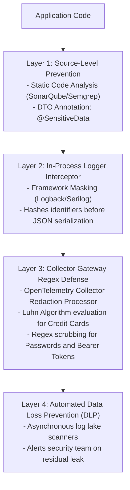

# Sensitive Data Protection: PII, PCI & Secrets Governance

## 1. Executive Summary
Logging pipelines are the most common source of accidental compliance violations in modern enterprises. Developers frequently log entire request payloads, exception dumps, or URL query parameters, inadvertently exposing **Personally Identifiable Information (PII), Payment Card Data (PAN), and Authentication Secrets** into unencrypted log lakes.

Enterprise architecture mandates a multi-layered **Defense-in-Depth Privacy Pipeline**: Prevent -> Detect -> Redact -> Mask -> Drop.

---

## 2. The Defense-in-Depth Privacy Architecture



---

## 3. Data Classification & Handling Rules

| Data Category | Examples | Permitted in Operational Logs? | Mandatory Handling Rule |
| :--- | :--- | :--- | :--- |
| **Authentication Secrets** | Passwords, API Keys, JWT Tokens, Private Keys | **ABSOLUTELY PROHIBITED** | **Drop immediately**. Replace with `[REDACTED_SECRET]`. |
| **Payment Data (PCI-DSS)** | Primary Account Number (PAN), CVV, PIN | **ABSOLUTELY PROHIBITED** | **Drop immediately**. Replace with `[REDACTED_PAN]`. Masked: `****-****-****-1234` only if business justified. |
| **Government Identifiers** | SSN, Passport Number, Driver's License | **ABSOLUTELY PROHIBITED** | Replace with one-way salted HMAC hash or `[REDACTED_SSN]`. |
| **Customer PII** | Full Name, Email Address, Phone Number, Home Address | **Restricted** | Pseudonymize or hash: `hash(user_email + salt)`. |
| **Technical Telemetry** | IP Address, User-Agent, Device Model | **Permitted** (With GDPR consent) | Truncate IP octets in EU regions (`192.168.1.xxx`). |

---

## 4. Production Redaction Implementation

OpenTelemetry Collector gateway configuration for automated PCI and Secret scrubbing:

```yaml
processors:
  redaction:
    allow_all_keys: false
    allowed_keys: [ "service.name", "http.method", "http.status_code", "error.class" ]
    blocked_values:
      # 1. Credit Card PANs (Visa, MasterCard, Amex)
      - "(?:4[0-9]{12}(?:[0-9]{3})?|5[1-5][0-9]{14}|3[47][0-9]{13})"
      # 2. Social Security Numbers
      - "\\b\\d{3}-\\d{2}-\\d{4}\\b"
      # 3. Bearer and Basic Auth Tokens
      - "Bearer\\s+[A-Za-z0-9\\-\\._~\\+\\/]+=*"
      - "Basic\\s+[A-Za-z0-9=]+"
```
