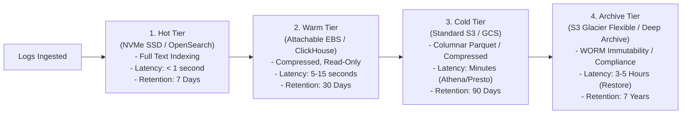

# Tiered Log Retention & Cost Engineering

## 1. Executive Summary
Storing all enterprise logs in high-performance, indexed NVMe storage (e.g., Elasticsearch/OpenSearch) for 365 days is financially ruinous. 95% of operational log queries occur within **48 hours of emission**; less than 0.01% of logs older than 30 days are ever queried, except during formal compliance audits.

Enterprise log architecture enforces a **Four-Tier Storage Lifecycle** that reduces storage TCO by over **80%**.

---

## 2. The Four-Tier Log Storage Lifecycle



---

## 3. Storage Tier Specifications & Cost Economics

| Tier | Storage Technology | Indexing Strategy | Cost per GB/Month | Primary Use Case |
| :--- | :--- | :--- | :--- | :--- |
| **Hot** | OpenSearch / Elasticsearch on NVMe SSD | 100% Inverted Index on all non-redacted fields | ~$0.25 - $0.50 | Active incident triage, real-time alerting, live tailing. |
| **Warm** | Read-only OpenSearch / ClickHouse / Loki | Block-level index; label-only indexing (Loki) | ~$0.08 - $0.15 | Post-mortem analysis, 30-day trend investigation. |
| **Cold** | Object Storage (AWS S3 Standard / GCS) | Partitioned by `date/service/region` in Parquet/JSON.gz | ~$0.023 | Ad-hoc SQL querying via AWS Athena / Trino for legal requests. |
| **Archive** | S3 Glacier Flexible / Deep Archive (WORM) | Zero index; compressed encrypted tar archives | ~$0.00099 - $0.004 | Regulatory retention (SOC2, PCI-DSS, HIPAA, FINRA). |

---

## 4. Automated Lifecycle Policies

Log management clusters must enforce automated Index State Management (ISM) policies:
```json
{
  "policy": {
    "description": "Enterprise standard 7d Hot -> 30d Warm -> S3 Cold lifecycle",
    "default_state": "hot",
    "states": [
      {
        "name": "hot",
        "actions": [{ "rollover": { "min_index_age": "7d", "min_primary_shard_size": "50gb" } }],
        "transitions": [{ "state_name": "warm" }]
      },
      {
        "name": "warm",
        "actions": [{ "read_only": {} }, { "replica_count": { "number_of_replicas": 0 } }],
        "transitions": [{ "state_name": "delete_from_index", "conditions": { "min_index_age": "30d" } }]
      }
    ]
  }
}
```
