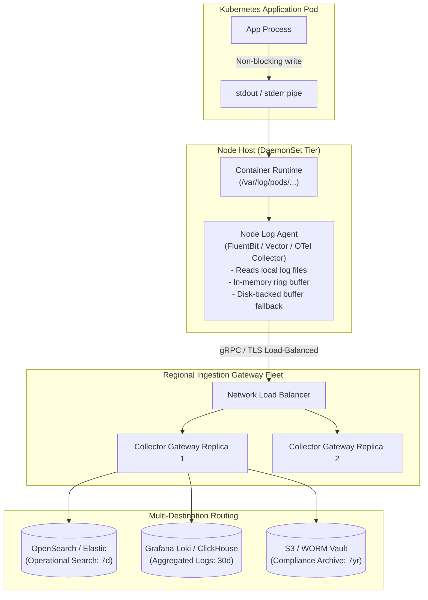

# Log Routing, Buffering & Ingestion Architecture

## 1. Executive Summary
Application pods must never write logs directly over high-latency network connections to centralized storage. A network glitch on the logging cluster must never stall transaction worker threads.

The enterprise log routing architecture uses an **asynchronous out-of-process pipeline**: applications log to `stdout` -> node-level agents collect and buffer -> regional gateway collectors parse, redact, and route to tiered backends.

---

## 2. Ingestion Pipeline Architecture

---

## 3. Backpressure & Failure Handling Policies

What happens when log volume spikes by $10\times$ during a cascading failure?

| Scenario | Agent Behavior | Application Impact | Architectural Rule |
| :--- | :--- | :--- | :--- |
| **Nominal Operation** | In-memory buffer flushes every 1s or 512KB. | Zero impact (< 0.1% CPU). | Target steady-state latency < 5s from log emission to searchability. |
| **Transient Network Blip** | Agent fails over to local disk-backed buffer (up to 5GB). | Zero impact. | Buffers absorb up to 2 hours of regional network partition. |
| **Catastrophic Pipeline Outage** | Disk buffer reaches 100% capacity. | **Agent drops logs via FIFO drop-oldest policy**. | **Non-Negotiable Rule**: The logging pipeline must drop logs rather than freezing or crashing the business application. |
