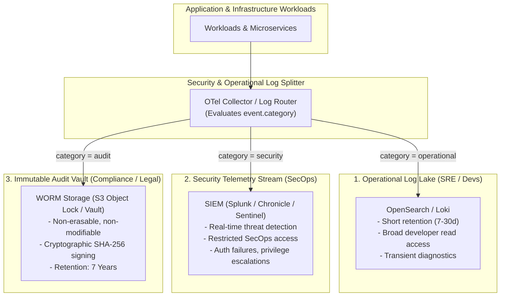

# Security Telemetry, SIEM & Tamper-Evident Audit Trails

## 1. Executive Summary
Not all logs serve the same operational or legal purpose. Confusing **Operational Diagnostic Logs** with **Security Telemetry** and **Compliance Audit Trails** creates severe compliance liabilities.

This document articulates the architectural separation between operational logs, security event streams (SIEM/SOAR), and tamper-evident audit logs required for regulatory governance (SOX, SOC2, PCI-DSS, HIPAA).

---

## 2. The Tripartite Logging Model

---

## 3. Comparison of the Three Log Types

| Architectural Dimension | Operational Diagnostic Logs | Security Telemetry (SIEM) | Regulatory Audit Trails |
| :--- | :--- | :--- | :--- |
| **Primary Audience** | Software Engineers, SREs | Security Operations Center (SOC) | Internal/External Auditors, Regulators |
| **Core Content** | Stack traces, HTTP status, execution latency. | Auth failures, token grants, firewall drops. | Money moved, records deleted, permissions altered. |
| **Access Control** | Broad engineering RBAC | Highly restricted SecOps RBAC | Read-only; strict break-glass audit access |
| **Immutability** | Best-effort; mutable by admins | Enforced by SIEM platform | **Cryptographically enforced WORM** |
| **Typical Retention** | 7 to 30 Days | 365 Days | **7 Years (Mandatory)** |

---

## 4. Tamper-Evidence via WORM Storage & Cryptographic Hashing

To satisfy regulatory requirements (e.g., SEC Rule 17a-4, PCI-DSS Requirement 10):
1. **WORM Storage (Write Once, Read Many)**: Audit logs are pushed directly to AWS S3 buckets configured with **S3 Object Lock in Compliance Mode**. Neither the SRE team, system administrators, nor the root cloud account holder can delete or modify these logs until the retention period expires.
2. **Cryptographic Chaining**: Each audit record contains the SHA-256 hash of the previous record, forming an immutable tamper-evident chain (similar to a verifiable append-only ledger). If an adversary modifies a record, the cryptographic hash verification breaks immediately.
