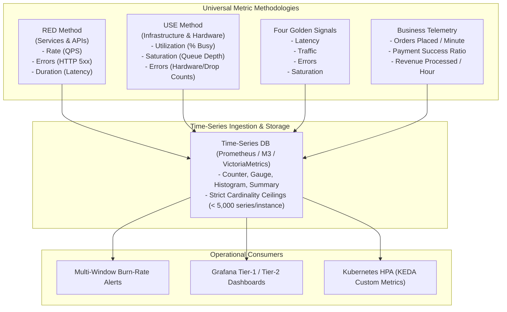

# Metrics Architecture & Design

## Executive Summary

Metrics are numeric, aggregatable time-series data points representing the operational state, resource utilization, and business throughput of an enterprise system. Unlike logs or traces, metrics have constant storage costs regardless of request volume, making them the primary foundation for real-time alerting, dashboards, and automated scaling.

This directory documents the mathematical fundamentals of metric types, the RED and USE methodologies, Google's Four Golden Signals, business telemetry integration, cardinality governance, histogram bucket optimization, and enterprise naming conventions.

---

## Directory Index

| Document | Architectural Focus |
| :--- | :--- |
| **[`fundamentals.md`](fundamentals.md)** | Counters, Gauges, Histograms, Summaries: mathematical data models, reset handling, and bucket mechanics. |
| **[`red-method.md`](red-method.md)** | The RED Method (Rate, Errors, Duration) applied to microservices, REST APIs, and event workers. |
| **[`use-method.md`](use-method.md)** | The USE Method (Utilization, Saturation, Errors) applied to CPU, memory, disk, network, and connection pools. |
| **[`golden-signals.md`](golden-signals.md)** | Google SRE Four Golden Signals (Latency, Traffic, Errors, Saturation) and harmonization with RED/USE. |
| **[`business-metrics.md`](business-metrics.md)** | Bridging technical health and business value: order volume, transaction success rates, and revenue impact. |
| **[`cardinality.md`](cardinality.md)** | The High-Cardinality Trap: index memory explosions, safe vs dangerous dimensions, and mitigation patterns. |
| **[`aggregation.md`](aggregation.md)** | Histogram bucket design, percentile pitfalls, recording rules, downsampling, and long-term retention. |
| **[`metric-design.md`](metric-design.md)** | Enterprise metric naming standards (`namespace_subsystem_name_unit`), label conventions, and ownership. |
| **[`anti-patterns.md`](anti-patterns.md)** | 12 Lethal metric anti-patterns (unbounded labels, logging as metrics, misleading averages, etc.). |
| **[`checklists/metrics-architecture-checklist.md`](checklists/metrics-architecture-checklist.md)** | 25-Point practical audit checklist for enterprise metrics design and governance. |
