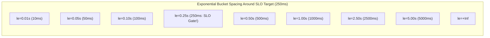

# Metric Aggregation, Histogram Bucketing & Recording Rules

## 1. Executive Summary
Querying raw, high-resolution time series across hundreds of microservices over 30-day windows causes severe dashboard rendering latency and exhausts monitoring server memory. Enterprise architectures solve this through **intelligent histogram bucket sizing**, **recording rules (pre-computation)**, and **automated tiered downsampling**.

---

## 2. Designing Optimal Histogram Buckets

A histogram's accuracy depends entirely on the design of its bucket thresholds ($le$).
- **The Uniform Spacing Pitfall**: Buckets spaced linearly (e.g., `0.1s, 0.2s, 0.3s, ..., 10.0s`) waste storage on uninteresting low-value ranges while lacking precision where user SLOs are evaluated.
- **The Exponential Standard**: Buckets should grow exponentially around critical SLO thresholds.



### The Linear Interpolation Reality
When Prometheus calculates `histogram_quantile(0.99, ...)`, it assumes observations are distributed **linearly** within the bucket containing the 99th percentile. 
- If your buckets are `[0.1, 10.0]`, and the 99th percentile falls inside that bucket, Prometheus will guess the quantile value across that entire 9.9-second spread, introducing massive statistical error.
- Ensure that the bucket boundaries tightly bracket your SLO targets (e.g., if your SLO is 250ms, have buckets at `0.20`, `0.25`, and `0.30`).

---

## 3. Pre-Computation via Prometheus Recording Rules

A complex query calculating cluster-wide P99 latency across 500 pods can take 15 seconds to execute. Placing this query on a dashboard refreshed by 50 engineers simultaneously will freeze the Prometheus server.

### The Solution: Recording Rules
A **Recording Rule** periodically evaluates a complex PromQL expression (e.g., every 30 seconds) and saves the result as a new, lightweight time series:

```yaml
# /etc/prometheus/rules/recording_rules.yaml
groups:
  - name: service_red_metrics_precomputed
    interval: 30s
    rules:
      # Pre-compute cluster-wide request rate
      - record: job:http_requests:rate1m
        expr: sum by (job, route) (rate(http_requests_total[1m]))

      # Pre-compute cluster-wide error ratio
      - record: job:http_errors:ratio1m
        expr: >
          sum by (job) (rate(http_requests_total{status=~"5.."}[1m]))
          /
          sum by (job) (rate(http_requests_total[1m]))

      # Pre-compute cluster-wide P99 latency
      - record: job:http_request_duration_seconds:p99
        expr: >
          histogram_quantile(0.99,
            sum by (job, le) (rate(http_request_duration_seconds_bucket[5m]))
          )
```
Dashboards and alerts query `job:http_request_duration_seconds:p99` instantly in $< 5\text{ms}$ instead of evaluating millions of raw datapoints.
