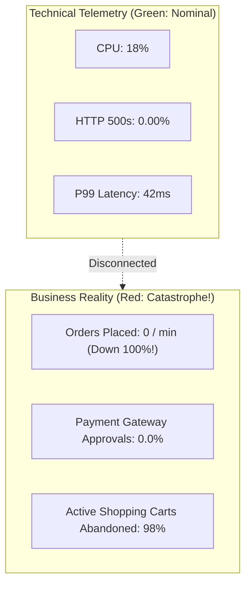

# Business Telemetry: Bridging Architecture & Business Value

## 1. Executive Summary
A system with zero HTTP 500 errors and nominal CPU utilization can still be experiencing a business catastrophe. For example:
- A broken third-party JavaScript widget causes the "Submit Order" button to vanish; HTTP traffic drops to zero, servers idle, technical alerts remain green, but revenue collapses to $0.
- A silent currency conversion bug processes $100 transactions as $1.00; the API returns HTTP 200 OK with zero errors while the company loses millions.

**Business Telemetry** measures the real-time throughput, conversion, and economic validity of core domain transactions, directly aligning engineering reliability with business revenue.

---

## 2. Technical Health vs Business Outcome



---

## 3. Enterprise Business Metric Taxonomy by Domain

| Business Domain | Core Business Metrics | Telemetry Type | Business Significance |
| :--- | :--- | :--- | :--- |
| **E-Commerce & Retail** | `checkout_orders_completed_total`<br>`checkout_revenue_dollars_total`<br>`cart_abandonment_ratio` | Counter<br>Counter<br>Gauge | Detects checkout workflow breaks, frontend JavaScript crashes, and payment drop-offs. |
| **Fintech & Payments** | `payment_authorization_success_ratio`<br>`payment_settlement_volume_cents`<br>`fraud_rejections_total` | Gauge (Ratio)<br>Counter<br>Counter | Identifies partner payment rail degradations, issuing bank outages, or false fraud triggers. |
| **Healthcare** | `patient_records_ingested_total`<br>`lab_results_delivery_delay_seconds`<br>`hl7_transformation_error_total` | Counter<br>Histogram<br>Counter | Guarantees patient safety and regulatory compliance (HIPAA, FHIR). |
| **Logistics & Supply Chain** | `packages_dispatched_total`<br>`warehouse_pick_duration_seconds`<br>`inventory_sync_lag_seconds` | Counter<br>Histogram<br>Gauge | Identifies physical fulfillment center bottlenecks and inventory reconciliation lag. |

---

## 4. Correlating Business Metrics with Deployments

By injecting business metrics into the same time-series engine as infrastructure metrics, SREs can execute **Automated Business Canary Analysis**:

```
[New Container Image Deployed to 5% Canary]
                     │
                     ▼
[Automated Evaluation Window: 15 Minutes]
  - Is Technical Error Rate < 0.1%? -> PASS (Green)
  - Is P99 Latency < 250ms? -> PASS (Green)
  - Is Checkout Conversion Rate >= 98% of Baseline? -> FAIL (Red: Conversion dropped by 40%!)
                     │
                     ▼
[Automated Rollback Triggered!]
  - Prevents revenue loss caused by subtle UI or logic bugs that do not throw exceptions.
```
