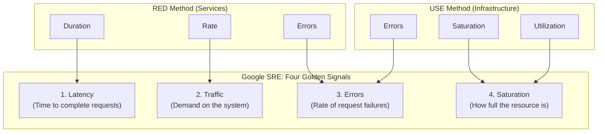

# The Four Golden Signals & Unified Metric Harmonization

## 1. Executive Summary
Detailed in the Google SRE Book, the **Four Golden Signals** (Latency, Traffic, Errors, and Saturation) represent the minimal, complete set of metrics required to understand the health of a distributed service.

This document harmonizes the **RED Method**, the **USE Method**, and the **Four Golden Signals** into a single cohesive enterprise observability framework.

---

## 2. Harmonizing the Frameworks



| Four Golden Signal | Service-Level Mapping (RED) | Infrastructure-Level Mapping (USE) | Core Diagnostic Question |
| :--- | :--- | :--- | :--- |
| **1. Latency** | **Duration**: P50, P90, P99 request durations. | I/O latency, disk seek time, network round-trip time (RTT). | *"How fast is the system responding to users?"* |
| **2. Traffic** | **Rate**: HTTP QPS, gRPC calls/sec, Kafka events/sec. | Network throughput (Gbps), disk writes/sec. | *"How much demand is currently placed on the system?"* |
| **3. Errors** | **Errors**: HTTP 5xx responses, gRPC error codes. | Network packet drops, disk write failures, memory OOMs. | *"How many requests are failing explicitly or implicitly?"* |
| **4. Saturation** | Worker thread queue depth, connection pool queue depth. | **Utilization & Saturation**: CPU load, RAM usage, disk queue length. | *"How close is the system to its ultimate architectural capacity?"* |

---

## 3. The Distinction Between Latency of Success vs Latency of Failure

A common architectural trap is measuring aggregated latency without separating successful requests from failed requests:
- **Fast Failures Obscure Real Latency**: If a database goes down, API endpoints immediately return `503 Service Unavailable` in 2 milliseconds. Aggregating this with normal traffic makes P99 latency look *faster* during a catastrophic outage!
- **Architectural Mandate**: Always segment latency histograms by status code class:
  ```promql
  # Latency of SUCCESSFUL transactions (True User Experience):
  histogram_quantile(0.99, 
    sum by (le) (rate(http_request_duration_seconds_bucket{status=~"2.."}[5m]))
  )
  ```
