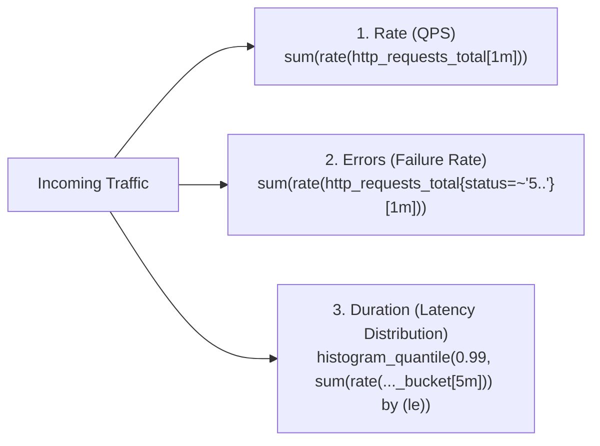

# The RED Method: Architecture for Services & APIs

## 1. Executive Summary
Formulated by Tom Wilkie, the **RED Method** is an opinionated, service-oriented observability pattern designed specifically for request-driven architectures (microservices, REST APIs, gRPC services, and web applications). 

Every service in an enterprise architecture must expose the three core RED metrics:
- **Rate**: The number of requests per second the service is processing.
- **Errors**: The number of those requests that are failing.
- **Duration**: The distribution of time those requests take to execute.

---

## 2. The RED Mathematical Formulations



### 1. Rate (Throughput)
Measures incoming demand and service capacity.
* **PromQL**:
  ```promql
  sum by (service, route) (rate(http_requests_total{service="checkout-service"}[1m]))
  ```
* **Architectural Utility**: Sudden drops in Rate indicate an upstream network partition or DNS failure; sudden spikes indicate a traffic surge or DDoS loop.

### 2. Errors (Reliability)
Measures the volume of requests failing to complete successfully.
* **PromQL (Error Rate)**:
  ```promql
  sum by (service, route) (rate(http_requests_total{service="checkout-service", status=~"5.."}[1m]))
  ```
* **PromQL (Error Ratio / Percentage)**:
  ```promql
  sum(rate(http_requests_total{service="checkout-service", status=~"5.."}[1m])) 
  / 
  sum(rate(http_requests_total{service="checkout-service"}[1m])) * 100
  ```
* **Architectural Rule**: Only server-side errors (HTTP 5xx, gRPC `INTERNAL`, `UNAVAILABLE`) count against the service's reliability error budget. Client errors (HTTP 4xx, e.g., 401 Unauthorized, 404 Not Found) are tracked on a separate dashboard to prevent malicious client scanners from triggering operational pages.

### 3. Duration (Latency)
Measures how long successful requests take to process.
* **PromQL (P99 Latency)**:
  ```promql
  histogram_quantile(0.99, 
    sum by (le) (rate(http_request_duration_seconds_bucket{service="checkout-service"}[5m]))
  )
  ```
* **PromQL (P50 Median Latency)**:
  ```promql
  histogram_quantile(0.50, 
    sum by (le) (rate(http_request_duration_seconds_bucket{service="checkout-service"}[5m]))
  )
  ```
