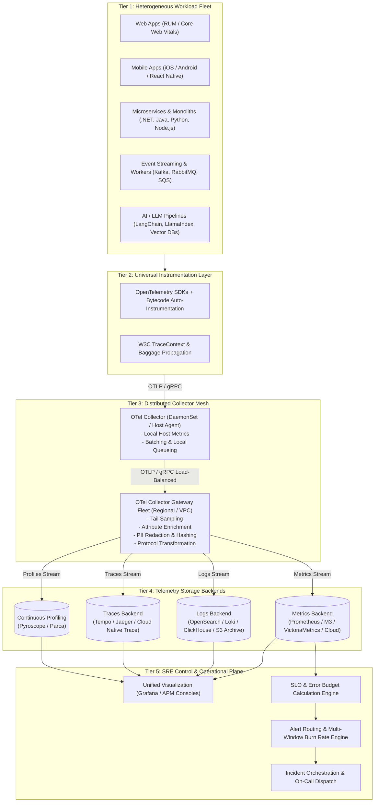

# Enterprise Observability Pipeline Architecture

## 1. Executive Summary
This document defines the canonical enterprise observability pipeline architecture. The architecture decouples telemetry generation within applications from ingestion, storage, and visualization backends through a standardized, vendor-neutral **OpenTelemetry (OTel) Collector Mesh**.

---

## 2. Canonical Observability Architecture

---

## 3. Architectural Tiers & Component Responsibilities

### Tier 1: Heterogeneous Workloads
- **Responsibilities**: Execute business logic; emit raw events, traces, metrics, and structured log records.
- **Protocols Supported**: In-process OTel API, HTTP/JSON (legacy), Syslog (legacy network appliances).

### Tier 2: Universal Instrumentation
- **OpenTelemetry Standard**: 100% vendor-neutral instrumentation using the OTel API and SDK.
- **Context Injection**: Automatic injection of W3C `traceparent` and `tracestate` headers into HTTP headers, gRPC metadata, and message broker record headers (Kafka record headers).
- **Non-Blocking Operation**: Instrumentation libraries write to bounded in-memory ring buffers. If the buffer is full, telemetry is dropped via atomic counter increment without degrading application threads.

### Tier 3: Distributed Collector Mesh
The enterprise collector deployment follows the **Agent + Gateway** pattern:
1. **Local Agent (Sidecar or DaemonSet)**:
   - Co-located on the same physical host or Kubernetes node as the application.
   - Accepts telemetry over localhost via gRPC (`localhost:4317`) or HTTP (`localhost:4318`).
   - Collects host and container utilization metrics (cgroups, network interfaces, disk).
   - Performs lightweight compression (`gzip` or `zstd`) and forwards to the Regional Gateway fleet.
2. **Regional Gateway Fleet (Clustered & Auto-Scaled)**:
   - High-throughput, stateless deployment behind a regional network load balancer.
   - **Processors**:
     - `memory_limiter`: Drops or sheds traffic before OTel Collector processes exceed memory thresholds.
     - `batch`: Buffers telemetry into efficient 512KB batches or 1-second windows to optimize backend network I/O.
     - `tail_sampling`: Retains 100% of traces containing HTTP 5xx errors or high latency ($> 2.0\text{s}$), while sampling nominal successful traces down to 1% to 5%.
     - `transform` & `redaction`: Regex scanning to redact credit card numbers (Luhn algorithm), bearer tokens, and PII.
     - `routing`: Multiplexes telemetry based on tenant ID or environment to specific data lakes or regulatory backends.

### Tier 4: Telemetry Storage Backends
- **Metrics**: High-write-throughput time-series databases optimized for downsampling and histogram percentiles.
- **Logs**: Tiered indexed search storage with automated lifecycle policies (Hot NVMe -> Warm SSD -> Cold S3/Blob -> Glacier Archive).
- **Traces**: Distributed trace indexing stores separating trace metadata from span payloads.
- **Continuous Profiling**: eBPF-based CPU/memory call-stack aggregators identifying CPU hot-spots at function-level resolution.

### Tier 5: SRE Control & Operational Plane
- **Correlation**: Trace-to-Log navigation via embedded Trace IDs; Metric-to-Trace via Prometheus Exemplars.
- **SLO Engine**: Continuously evaluates SLI success ratios over 7-day and 30-day rolling evaluation windows.
- **AlertManager**: Deduplicates alerts across service trees, evaluates multi-window burn rates, and routes pages based on dynamic service catalog ownership.

---

## 4. Key Architectural Trade-Offs

| Decision Dimension | Option A: Single In-Process Direct Exporter | Option B: Node Agent Only | Option C: Agent + Gateway Mesh (Enterprise Standard) |
| :--- | :--- | :--- | :--- |
| **Application Overhead** | High (Apps handle retry, TLS, buffer memory) | Minimal (Offloads to localhost immediately) | Minimal (Localhost offload; heavy work in gateway) |
| **Tail Sampling Feasibility** | Impossible across distributed nodes | Ineffective (Agent only sees local spans) | **Full Capability** (Gateway traces entire user journey) |
| **Security & Credential Scope** | Backend credentials baked into every app pod | Credentials distributed to every node agent | **Centralized** (Credentials isolated to gateway tier) |
| **Infrastructure Cost** | Low collector cost; high backend ingest cost | Medium collector cost; medium ingest cost | **Lowest Total TCO** (Aggressive tail sampling and filtering) |
