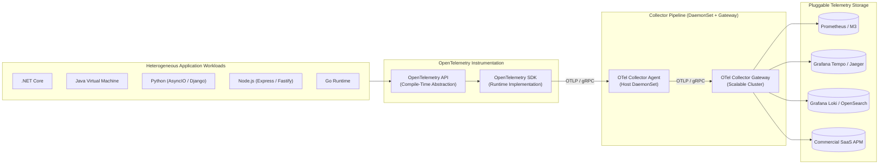

# OpenTelemetry (OTel) Architecture & Governance

## Executive Summary

OpenTelemetry (OTel) is the vendor-neutral, CNCF-standardized telemetry framework providing a single set of APIs, SDKs, tooling, and collector infrastructure for capturing metrics, distributed traces, and structured logs.

In an enterprise architecture, OpenTelemetry decouples application code from proprietary monitoring vendors (Datadog, Dynatrace, New Relic, Honeycomb, Splunk, AWS CloudWatch). This directory documents the enterprise architecture, deployment patterns, context propagation rules, sampling strategies, and governance required to operate OpenTelemetry at high scale across heterogeneous runtimes.

---

## Directory Index

| Document | Architectural Focus |
| :--- | :--- |
| **[`fundamentals.md`](fundamentals.md)** | Core OTel architecture: API vs SDK boundary, tracer/meter providers, resource attributes, and exporters. |
| **[`auto-vs-manual-instrumentation.md`](auto-vs-manual-instrumentation.md)** | Bytecode agent vs code-level manual instrumentation trade-offs, overhead, and hybrid architecture. |
| **[`collector-architecture.md`](collector-architecture.md)** | Agent vs Gateway vs Agent+Gateway deployment patterns, memory limiting, batching, and routing pipelines. |
| **[`context-propagation.md`](context-propagation.md)** | W3C TraceContext (`traceparent`, `tracestate`), cross-thread executors, and asynchronous message broker propagation. |
| **[`baggage.md`](baggage.md)** | OpenTelemetry Baggage: Cross-cutting metadata propagation, security/privacy risks, and strict bounded usage. |
| **[`sampling.md`](sampling.md)** | Head vs tail sampling, probabilistic, rate-limiting, adaptive sampling, and economics of high-volume tracing. |
| **[`semantic-conventions.md`](semantic-conventions.md)** | CNCF OpenTelemetry semantic conventions for HTTP, RPC, database, and messaging spans and metric names. |
| **[`technology-guides.md`](technology-guides.md)** | Practical enterprise implementation guides for .NET, Java, Python, Node.js, Browser, Mobile, DBs, and Messaging. |
| **[`governance.md`](governance.md)** | Enterprise naming standards, attribute governance, cardinality control, and PII masking policies. |
| **[`checklists/opentelemetry-architecture-checklist.md`](checklists/opentelemetry-architecture-checklist.md)** | 25-Point practical audit checklist for OpenTelemetry production readiness. |
