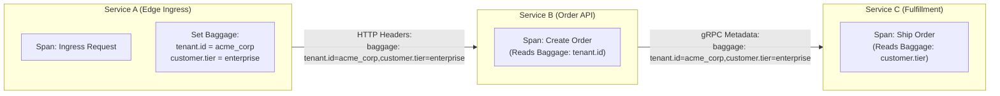

# OpenTelemetry Baggage: Cross-Cutting Metadata Architecture

## 1. Executive Summary
While W3C `traceparent` propagates trace IDs, **OpenTelemetry Baggage** propagates arbitrary key-value pairs (e.g., `tenant.id`, `customer.tier`, `account.region`) across distributed service boundaries alongside trace context. Unlike span attributes—which remain local to the span on which they are set—**Baggage travels downstream across every subsequent network hop**.

---

## 2. The Baggage Propagation Model

---

## 3. Baggage vs Span Attributes vs Resource Attributes

| Dimension | Resource Attributes | Span Attributes | OpenTelemetry Baggage |
| :--- | :--- | :--- | :--- |
| **Scope** | Process-wide (Static). | Single Span (Local). | Distributed (Propagates downstream). |
| **Examples** | `service.name`, `host.id` | `http.status_code`, `db.statement` | `tenant.id`, `user.auth_tier`, `routing_cell` |
| **Wire Impact** | Never sent on request path. | Never sent on request path. | **Appended to every HTTP / gRPC / Kafka header!** |
| **Storage Visibility**| Indexable on all spans. | Indexable on that specific span. | **NOT stored in traces by default!** |

> [!IMPORTANT]
> **Baggage is NOT automatically indexed on spans!**
> Setting a baggage item does *not* mean it will appear on spans in Jaeger or Tempo. If you want a baggage item (e.g., `tenant.id`) to be visible as a searchable span attribute, downstream code or an OTel Collector processor must explicitly copy the baggage key into a span attribute.

---

## 4. Architectural Risks & Governance Rules

Because Baggage is transmitted over the wire across every network boundary, un-governed usage introduces severe architectural vulnerabilities:

### Risk 1: Network Overhead & Header Amplification
If developers use Baggage as a generic distributed cache (e.g., passing large JSON tokens or user profile blobs), HTTP request headers inflate, leading to `431 Request Header Fields Too Large` errors at load balancers.
* **Governance Rule**: Maximum baggage payload size is **512 bytes**. Maximum number of baggage keys is **5**.

### Risk 2: Security & Sensitive Data Leakage
Baggage travels across trust boundaries, including egress calls to external third-party partner APIs.
* **Governance Rule**: **Zero PII or Secrets in Baggage**. Passwords, authorization bearer tokens, PAN credit card numbers, and PII are strictly banned from Baggage. Egress proxies must strip `baggage` headers before forwarding traffic to third-party endpoints.
