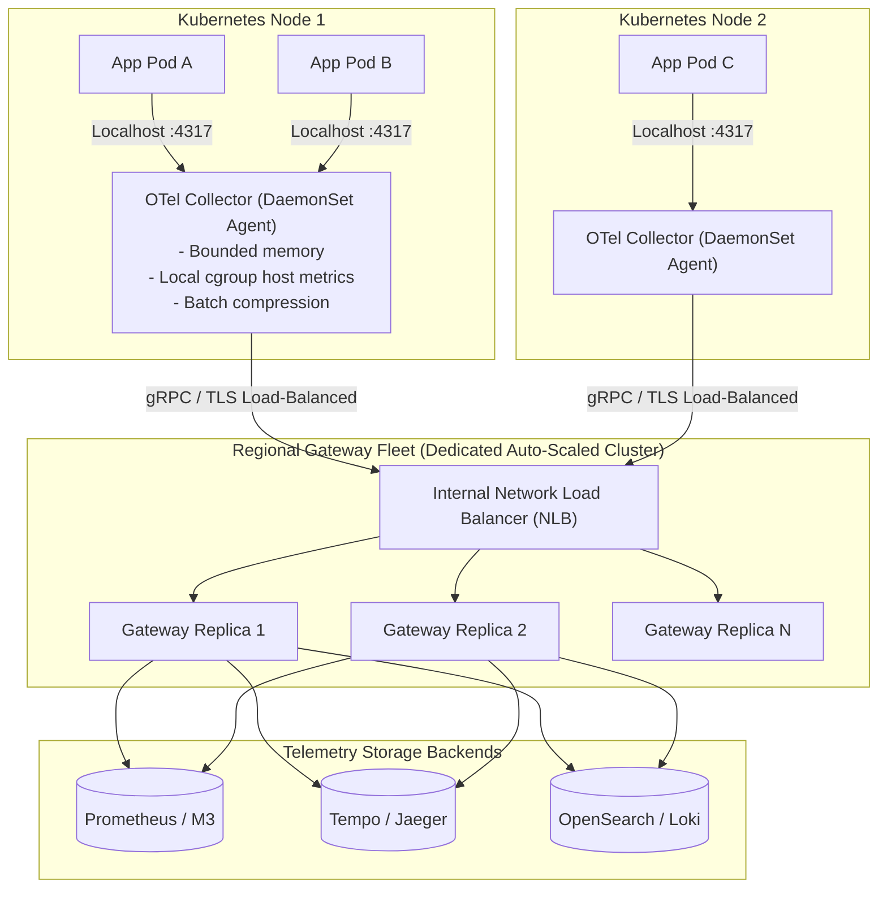

# OpenTelemetry Collector Architecture & Mesh Design

## 1. Executive Summary
The **OpenTelemetry Collector** is a high-performance, proxy-like data processing engine written in Go. It receives telemetry from multiple sources, processes it (filtering, batching, tail sampling, scrubbing), and exports it to one or more backends. In large-scale enterprise deployments, the Collector must be architected as a two-tier mesh: **Node Agents** (DaemonSet) combined with a **Regional Gateway Fleet**.

---

## 2. Collector Deployment Topologies



---

## 3. The Collector Pipeline Architecture

Every OpenTelemetry Collector pipeline follows a deterministic four-stage lifecycle:

```
Receivers ──► Processors ──► Exporters ──► (Connectors)
```

1. **Receivers**: Push or pull data into the collector (e.g., `otlp`, `prometheus`, `hostmetrics`, `jaeger`).
2. **Processors**: Execute sequential transformations on telemetry in memory. **Order of processors is strictly significant**:
   - `memory_limiter`: **MUST ALWAYS BE FIRST**. Drops or sheds data before collector memory hits hard limits.
   - `batch`: Buffers data to optimize network round-trips and backend compression.
   - `tail_sampling`: Evaluates complete distributed traces before making a sampling decision.
   - `redaction`: Regex filters scrub credit card numbers and passwords from log and trace payloads.
   - `transform`: OTTL (OpenTelemetry Transformation Language) rules rewrite attributes or metric names.
3. **Exporters**: Send data to backends (e.g., `otlp/grpc`, `prometheusremotewrite`, `kafka`).

---

## 4. Production OpenTelemetry Collector Configuration Spec

```yaml
# /etc/otelcol/config.yaml - Production Gateway Fleet Configuration
receivers:
  otlp:
    protocols:
      grpc:
        endpoint: 0.0.0.0:4317
        max_concurrent_streams: 1024
      http:
        endpoint: 0.0.0.0:4318

processors:
  # 1. Memory Limiter MUST be the first processor in the pipeline!
  memory_limiter:
    check_interval: 1s
    limit_percentage: 80
    spike_limit_percentage: 20

  # 2. Tail Sampling Processor (Ensures 100% of errors are captured)
  tail_sampling:
    decision_wait: 10s
    num_traces: 100000
    expected_new_traces_per_sec: 5000
    policies:
      # Policy 1: Always sample traces containing HTTP/gRPC errors
      - name: sample-errors
        type: status_code
        status_code: { status_codes: [ ERROR ] }
      # Policy 2: Always sample traces exceeding latency SLO threshold (> 2000ms)
      - name: sample-high-latency
        type: latency
        latency: { threshold_ms: 2000 }
      # Policy 3: Sample nominal successful traces down to 5%
      - name: probabilistic-success
        type: probabilistic
        probabilistic: { sampling_percentage: 5.0 }

  # 3. PII Redaction
  redaction:
    allow_all_keys: false
    allowed_keys: [ "service.name", "http.method", "http.status_code", "error" ]
    blocked_values:
      - "(?:4[0-9]{12}(?:[0-9]{3})?|5[1-5][0-9]{14})" # Visa / MasterCard regex

  # 4. Batch Processor
  batch:
    send_batch_size: 8192
    timeout: 1s
    send_batch_max_size: 10240

exporters:
  otlp/tempo:
    endpoint: tempo-distributor.monitoring.svc.cluster.local:4317
    tls:
      insecure: true
  prometheusremotewrite:
    endpoint: http://prometheus-server.monitoring.svc.cluster.local:9090/api/v1/write

service:
  pipelines:
    traces:
      receivers: [ otlp ]
      processors: [ memory_limiter, tail_sampling, redaction, batch ]
      exporters: [ otlp/tempo ]
    metrics:
      receivers: [ otlp ]
      processors: [ memory_limiter, batch ]
      exporters: [ prometheusremotewrite ]
  telemetry:
    logs:
      level: info
    metrics:
      address: 0.0.0.0:8888 # Internal metrics of the collector itself
```
