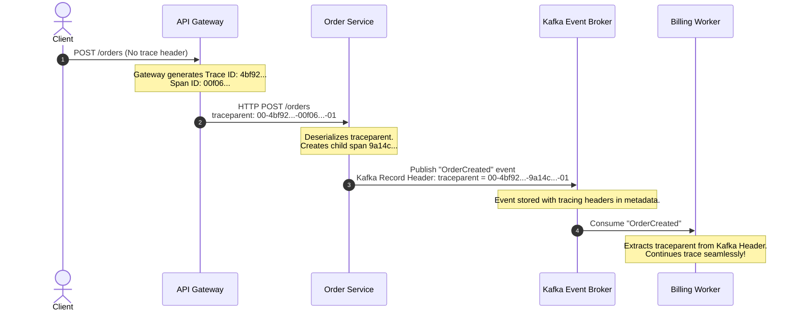

# Distributed Context Propagation & W3C TraceContext

## 1. Executive Summary
In a distributed microservice or event-driven system, no single server has end-to-end visibility of a transaction. **Context Propagation** is the foundational mechanism that serializes tracing metadata and injects it into wire protocols, allowing downstream services to deserialize the context and continue the causal chain within the same distributed trace.

---

## 2. The W3C TraceContext Standard

OpenTelemetry mandates the **W3C TraceContext** specification (`traceparent` and `tracestate` headers) across all HTTP, gRPC, and messaging protocols.

```
Request Wire Headers:
traceparent: 00-4bf92f3577b34da6a3ce929d0e0e4736-00f067aa0ba902b7-01
              │  └──────────────┬────────────────┘ └───────┬────────┘ └─┬┘
              │                 │                          │            │
          Version        Trace ID (16 Bytes)       Parent Span ID     Trace Flags
          (2 Hex)            (32 Hex)                 (16 Hex)          (2 Hex)
```

### Breakdown of `traceparent` Fields
- **Version (`00`)**: Current W3C specification version.
- **Trace ID (`4bf92f3577b34da6a3ce929d0e0e4736`)**: Unique 128-bit identifier generated by the edge service. Unaltered throughout the entire distributed lifecycle.
- **Parent Span ID (`00f067aa0ba902b7`)**: Unique 64-bit identifier of the calling span.
- **Trace Flags (`01`)**: 8-bit bitmap. `01` indicates the trace was **sampled** by the caller and should be recorded by downstream receivers.

### The `tracestate` Header
- Used for vendor-specific or custom routing metadata without violating the core W3C Trace ID format (e.g., `tracestate: congo=t61rcWkgMzE,rojo=00f067a`).

---

## 3. Propagation Across Heterogeneous Protocols



---

## 4. The Cross-Thread & Async Context Loss Trap

In asynchronous runtimes (Java `CompletableFuture`, C# `Task.Run`, Python `asyncio.create_task`, Go goroutines), context does not automatically propagate to child threads unless explicitly configured:

### The Pitfall: Context Evaporation
```java
// ANTI-PATTERN in Java: Loses tracing context!
Tracer tracer = GlobalOpenTelemetry.getTracer("order-service");
Span parentSpan = tracer.spanBuilder("process-order").startSpan();
try (Scope scope = parentSpan.makeCurrent()) {
    // Thread pool dispatch without context propagation!
    executorService.submit(() -> {
        // BUG: Span.current() here is EMPTY (Tracer creates an orphan trace!)
        doDatabaseWork(); 
    });
}
```

### The Architectural Remediation: Wrapped Executors
```java
// CORRECT: Wrap executor with OpenTelemetry Context carrier
Executor wrappedExecutor = Context.taskWrapping(executorService);
wrappedExecutor.execute(() -> {
    // PASS: Tracing context is correctly preserved on the worker thread!
    doDatabaseWork();
});
```
