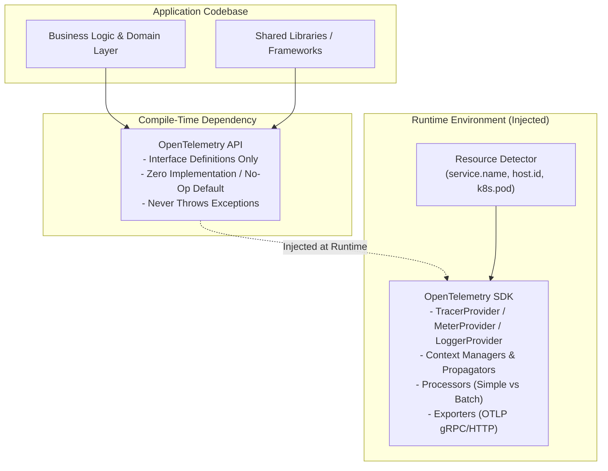

# OpenTelemetry Fundamentals & Architectural Model

## 1. Executive Summary
OpenTelemetry is intentionally architected with a strict separation between the **API** (compile-time dependency) and the **SDK** (runtime implementation). Understanding this boundary is critical for enterprise software architects to prevent vendor lock-in, enable zero-touch dependency upgrades, and guarantee testability across hundreds of internal libraries and services.

---

## 2. The Core OTel Architectural Components



### 1. The API (Application Programming Interface)
- **Zero Heavy Dependencies**: The API contains only the interfaces, types, and no-op default implementations.
- **Shared Library Rule**: Internal shared libraries (e.g., corporate database clients, gRPC middleware) must **only import the OpenTelemetry API**. They must never import the SDK. This guarantees that internal libraries remain completely decoupled from runtime export configurations.
- **Fail-Safe**: If no SDK is registered at runtime, the API defaults to no-op operations with near-zero CPU overhead and zero memory allocation.

### 2. The SDK (Software Development Kit)
- **Runtime Registration**: The SDK is initialized exactly once during application bootstrap (`main()` or container startup).
- **Core Responsibilities**:
  - `TracerProvider` & `MeterProvider`: Factory objects that create named tracers and meters, managing their configuration.
  - `SpanProcessor`: Controls span lifecycle. Enterprise standard: **`BatchSpanProcessor`** (asynchronously flushes batches to avoid blocking request worker threads).
  - `Exporter`: Serializes telemetry into OTLP (OpenTelemetry Protocol) over gRPC (`protobuf`) or HTTP (`JSON/protobuf`).

### 3. Resource Attributes
A `Resource` represents the entity producing telemetry. Standard attributes must be attached to the SDK at bootstrap:
```json
{
  "service.name": "payment-processing-service",
  "service.version": "3.14.2",
  "service.instance.id": "pod-payment-7bf88c9f5d-kx92j",
  "deployment.environment": "production",
  "cloud.provider": "aws",
  "cloud.region": "us-east-1",
  "k8s.cluster.name": "prod-core-cluster-01",
  "k8s.namespace.name": "payments"
}
```

---

## 3. Instrumentation Boundaries & Threading Safety

1. **Non-Blocking Telemetry Invariant**: An application thread processing a customer transaction must never block on telemetry export. If an exporter fails (e.g., collector offline), the SDK drops spans via atomic counter increment.
2. **Context Leakage Prevention**: In asynchronous and reactive runtimes (Node.js event loop, Java Netty/Reactive Streams, Python AsyncIO, C# `Task`/`async`), telemetry context must use runtime-native context carriers (`AsyncLocalStorage`, `ThreadLocal`, `ExecutionContext`) to prevent span cross-contamination across concurrent requests.
